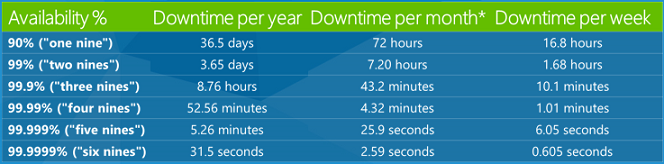
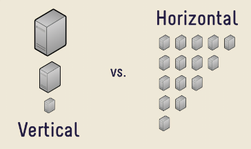

<h1> Descrever os benefícios do uso de serviços de nuvem </h1>

# Benefícios da Alta Disponibilidade e Escalabilidade na Nuvem

Ao utilizar um serviço ou aplicativo da nuvem, deve-ser considerado dois fatores: tempo de atividade ou disponibilidade (**uptime**) e a capacidade de lidar com a demanda (escalabilidade)

## Alta Disponibilidade (UpTime)

**A alta disponibilidade** significa garantir a **disponibilidade máxima**, independente de interrupções ou eventos que possam ocorrer.

Ao arquitetar uma solução, deve ser levado em conta as **garantias de disponibilidade do serviço**, que são as SLAs ou contratos de nível de serviço (*Service Level Agreement*)

### SLAs - Garantias de Disponibilidade do Serviço

São contratos formais entre um provedor de serviço e o cliente, que garante ao cliente um nível de serviço declarado

- A disponibilidade, gira em torno de 99%, 99,95% e 99,99% pois 100% é custoso e difícil de se alcançar.
  - **99% de SLA ou Disponibilidade**, significa que o serviço pode ficar 1% indisponível (*downtime*/fora do ar) durante uma semana, ou seja, durante uma semana, um recurso pode passar 1,68 horas do tempo indisponível.
- As SLA, quanto mais perto do 100%, mais cara ela é de se adquirir.

## Escalabilidade

Com a computação a nuvem, outro grande benefício é a **capacidade de ajustar recursos par atender à demanda** (**escalabilidade**). Por exemplo, o pico repentino de tráfego sobre um sistema em uma data de feriado.

Sendo um **modelo baseado em consumo**, se a demanda cair, reduzirá seus recursos e por consequência, reduzirá seus custos.

Há duas maneiras de se escalar um aplicativo: de modo **vertical** ou **horizontal**. Sendo que a vertical, trabalha com a capacidade dos recursos (potência), e a horizontal, a quantidade do número dos recursos (quantidade). Ambos podendo ser configurados automaticamente ou manualmente

### Dimensionamento Vertical (Capacidade)

Utiliza-se quando precisa de maior capacidade de processamento, você pode escalar verticalmente para adicionar mais CPUs ou RAM à máquina virtual ou diminuir as especificações de CPU ou RAM.

### Dimensionamento Horizontal (Quantidade)

Utiliza-se quando têm um salto repentino na demanda, você pode escalar horizontalmente para expandir a quantidade de máquinas virtuais ou contêineres, ou reduzir a mesma quantidade quando há uma queda significativa na demanda.

# Benefícios da Confiabilidade e da Previsibilidade na nuvem

Confiabilidade e Previsibilidade são dois benefícios cruciais que um provedor da nuvem deve oferecer para ajudar os desenvolvedores a criar soluções com confiança e segurança.

## Confiabilidade

**Resiliência** é a capacidade de um sistema de se recuperar de falhas e continuar operando, sendo também um dos pilares do Microsoft Azure Well-Architected Framework.

Com o design descentralizado, a nuvem consegue dar suporte a uma infraestrutura confiável e resiliente. Permitindo que os desenvolvedores consigam ter recursos implantados em várias regiões do mundo. Se houver um evento fatal em uma região, as outras regiões ainda estarão funcionando normalmente.

## Previsibilidade

Permite que **custos** e **desempenho** se tornem previsíveis em casos futuros. São bastante influenciadas pelo Microsoft Azure Well-Architected Framework.

### Previsibilidade de desempenho

A **previsibilidade do desempenho** se concentra em prever os recursos necessários para oferecer uma experiência positiva aos clientes.

Utilizando ferramentas como: **dimensionamento automático**, **balanceamento de carga** e alta **disponibilidade**, para controlar o acesso às soluções conforme surge sobrecargas sobre os sistemas e lidar com essas sobrecargas.

### Previsibilidade de custos

Se concentra em prever o custo dos gastos com a nuvem. No qual o desenvolvedor pode acompanhar o uso de recursos em **tempo real**, monitorar os recursos para garantir a maior eficiência de uso possível e aplicar a análise de dados para encontrar padrões que ajudam a planejar melhor as implantações de recursos.

você pode prever custos futuros e ajustar os recursos conforme o necessário. Podendo usar ferramentas como **TCO** (*total cost of ownership* ou custo total de propriedade) ou a Calculadora de Preços para obter uma estimativa de possíveis gastos com a nuvem.

# Benefícios da Segurança e da Governança na Nuvem

Quando usa-se IaaS, os recursos de nuvem darão suporte à governança e à conformidade. Itens como **modelos de conjunto** ajudam a garantir que todos os recursos implantados atendam aos **padrões corporativos** e aos **requisitos regulatórios governamentais**

- Na nuvem você consegue atualizar todos os recursos implantados com novos padrões, à medida que os padrões são alterados
- A **auditoria baseada em nuvem** ajuda a sinalizar qualquer recurso que esteja fora da conformidade estabelecido pela empresa, e fornece estratégias de mitigação
- Você consegue encontrar uma **solução de nuvem** que atenda ás necessidades de sua segurança.
  - Para o controle máximo da segurança, a **IaaS** é mais recomendada, fornecendo recursos físicos com você gerenciando os sistemas operacionais e o software instalado (aplicação de patches e manutenção)
  - Se desejara que a aplicação de patches e a manutenção sejam tratadas automaticamente, PaaS ou SaaS pode ser as melhores estratégias que podem ser adotadas

Como a nuvem se destina a uma entrega de recursos de TI via Internet, os provedores de nuvem normalmente são adequados para lidar com ataques de DDoS.

Também recomenda-se a presença de governança, pois manterá a presença de nuvem atualizada, protegida e bem gerenciada.

# Benefícios da Capacidade de Gerenciamento na Nuvem

Há dois tipos de Capacidade de Gerenciamento de Nuvem

## Gerenciamento da Nuvem (a forma)

Diz respeito sobre **como gerenciar seus recursos de nuvem**. Na nuvem, você pode:

- Escalar automaticamente os recursos com base na demanda
- Implantar recursos com base em um modelo pré-configurado
- Monitorar a integridade dos recursos e substitui os que apresentam falhas
- Receber alertas automáticos com base em métricas configuradas, ficando ciente do desempenho em tempo real

## Gerenciamento na nuvem (o meio)

Diz respeito ao **modo de gerenciar seu ambiente de nuvem e seus recursos**. Podendo gerencía-los:

- Por meio de um portal Web (plataforma web).
- Usando uma CLI ou o PowerShell
- Usando APIs

# Recursos adicionais

- [Criar ótimas soluções com o Microsoft Azure Well-Architected Framework](https://learn.microsoft.com/pt-br/learn/paths/azure-well-architected-framework/) é um curso do Microsoft Learn que apresenta o Microsoft Azure Well-Architected Framework.
