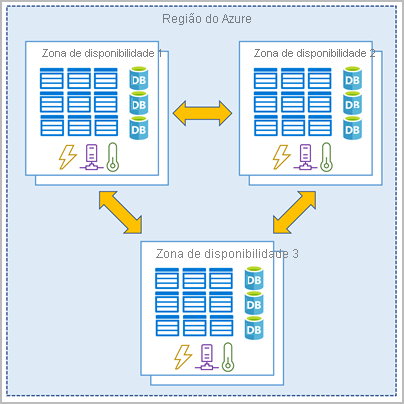

<h1> Descrever os principais componentes arquitetônicos do Azure </h1>

- [O que é o Microsoft Azure](#o-que-é-o-microsoft-azure)
- [Contas do Azure](#contas-do-azure)
  - [Testando recursos em uma conta](#testando-recursos-em-uma-conta)
- [Exercício - Explorando o Sandbox do Learn](#exercício---explorando-o-sandbox-do-learn)
- [Infraestrutura física do Azure](#infraestrutura-física-do-azure)
  - [Infraestrutura física](#infraestrutura-física)
    - [Regiões](#regiões)
    - [Zonas de Disponibilidade](#zonas-de-disponibilidade)
      - [Usar zonas de disponibilidade nos aplicativos](#usar-zonas-de-disponibilidade-nos-aplicativos)
    - [Pares de Regiões](#pares-de-regiões)
    - [Regiões Soberanas](#regiões-soberanas)
- [Infraestrutura de Gerenciamento do Azure](#infraestrutura-de-gerenciamento-do-azure)
  - [Recursos e Grupo de Recursos](#recursos-e-grupo-de-recursos)
  - [Assinaturas (Subscriptions) do Azure](#assinaturas-subscriptions-do-azure)
    - [Criar Assinaturas Adicionais](#criar-assinaturas-adicionais)
  - [Grupos de Gerenciamento do Azure](#grupos-de-gerenciamento-do-azure)
- [Exercício - Criando um recurso do Azure](#exercício---criando-um-recurso-do-azure)

# O que é o Microsoft Azure

É a plataforma e Cloud Computing da Microsoft, com vários conjuntos de serviços que são pagos conforme o uso e que estão em constante expansão, que ajuda os desenvolvedores a superar os desafios empresariais atuais e se preparar para os desafios futuros.

- Dá suporte à computação de IaaS, PaaS e SaaS, com serviços (soluções) como VMs, hospedagem de site e banco de dados e serviços de computação avançada, como IA, ML, e IoT
- Oferece armazenamento baseado em nuvem (armazenar ou fazer backup de dados)
- Oferece serviço de hospedagem escalonável, que permite os desenvolvedores criar usando as ferramentas que quiserem (PHP, Python, Node, Java)

# Contas do Azure

- É necessário uma assinatura do Azure para criar e usar os serviços dos Azure
- É possível criar **assinaturas adicionais** para fins de gerenciamento de recursos ou orçamento.

Por exemplo se uma empresa quer ter apenas uma conta do Azure para os negócios e **assinaturas separadas** para cada departamento de TI, e organizar essas assinaturas adicionar em seções de fatura, configurando várias faturas dentro da mesma conta de cobrança usando perfis de cobranças (cada perfil tem sua própria fatura mensal e formas de pagamento).


É possível criar uma [conta estudante gratuita](https://azure.microsoft.com/free/students/) do Azure que oferece:

- Acesso gratuito a determinados produtos do Azure por 12 meses.
- Um crédito a ser usado nos primeiros 12 meses.
- Acesso gratuito a determinadas ferramentas para desenvolvedores de software.

## Testando recursos em uma conta

O Microsoft Learn oferece uma **laboratório sandbox** (área restrita) que fornece acesso a recursos gratuitos, usado apenas para o treinamento dentro da plataforma Learn

# Exercício - Explorando o Sandbox do Learn

- Você consegue usar a **CLI do PowerShell** para gerenciar o ambiente do Azure
- A maioria dos comandos do Azure começa com as letras `az`

```powershell
# Use o comando Get-date do PowerShell para obter a data e a hora atuais.
Get-Date
# Usar o comando az version, para ver a versão do CLI do azure
az version
```


- É possível usar a CLI do BASH também, escrevendo `bash`
- Ou voltar novamente para o PowerShell, escrevendo `pwsh`

```bash
# Use o comando date do Bash para obter a data e a hora atuais.
date
```

- É possível usar o **modo interativo** da CLI do Azure usando o comando `az interactive`. É semelhante a uma IDE (ambiente de desenvolvimento integrado), mas o uso de `az` não é obrigatório para escrever um comando que interaja diretamente com o Azure.
- É possível usar o **portal do Azure** também para gerenciar os recursos do Azure.

# Infraestrutura física do Azure

Os principais componentes da arquitetura do Azure podem ser divididos em dois agrupamentos principais:

- Infraestrutura física
- Infraestrutura de Gerenciamento

## Infraestrutura física

Começa com datacenters (instalações com recursos organizados em racks com energia, refrigeração e infraestrutura de rede dedicadas) instaladas em várias regiões do mundo.

Eles são agrupados em **Regiões do Azure** ou em **Zonas de Disponibilidade do Azure**, projetadas para obter a **resiliência e confiabilidade** para obter performance e trabalhar com cargas de trabalho críticas para os negócios.

### Regiões

É uma **área geográfica** do planeta que contém pelo menos um datacenter, que são conectados a uma rede de baixa latência. Com o Azure controlando acesso aos recursos de cada região de modo inteligente, garantindo que as cargas de trabalho sejam **balanceadas corretamente**.

- Quando você implanta um recurso, você necessariamente precisa escolher a região em que ele será implantado.
- Alguns serviços/recursos de VM estão disponíveis somente em determinadas regiões.
- Há alguns serviços globais que não exigem uma região especifica, como o Azure Active Directory, o Gerenciador de Tráfego do Azure, ou o DNS do Azure.

### Zonas de Disponibilidade

São datacenters separados fisicamente dentro de uma região do Azure. Cada zona é composta de um ou mais datacenters.

- Uma zona é configurada para ser um limite de isolamento.
- Se uma zona ficar inativa, as outras continuarão funcionando.
- São conectadas por meio de redes de fibra óptica privadas de alta velocidade.



Nem todas as Regiões do Azure atualmente dão suporte a zonas de disponibilidade, mas as que suportam, possuem no mínimo 3 zonas de disponibilidades separadas entre si.

#### Usar zonas de disponibilidade nos aplicativos

Ao hospedar a infraestrutura, a configuração de sua redundância exigirá a criação de ambientes de hardware duplicados. O Azure pode tornar o aplicativo **altamente disponível** por meio dessas zonas de disponibilidade.

- As zonas são usadas principalmente à VMs, discos gerenciados, balanceadores de cargas e banco de dados SQL.
- Os serviços que dão suporte às zonas de disponibilidade possuem três categorias
  - **Serviços em zonas:** fixa o recurso a uma zona específica (exemplo: VMs, endereços IP)
  - **Serviços com redundância de zona:** replicação automática entre zonas (exemplo: Banco de Dados SQL)
  - **Serviços não regionais:** serviços  serviços sempre disponíveis em geografias do Azure, sendo também resilientes a interrupções em toda a zona ou toda região

Para lidar com casos que um evento afete várias zonas de disponibilidades em uma só região, o Azure oferece Pares de Regiões

### Pares de Regiões

A maioria das regiões é **emparelhada** a outra região na mesma geografia (EUA, Europa ou Ásia) a pelo menos 300 milhas (480km) de distância.

- Isso ajuda a replicação de recursos em uma geografia, reduzindo a probabilidade de interrupções, devido a eventos críticos, afetarem toda uma região.
- Se uma região em um par for afetada por um evento crítico, os serviços fariam failover (tolerância à falhas) automaticamente para a outra região nesse par.
- Nem todos os serviços replicam dados automaticamente ou retornam automaticamente de uma região com falha para replicação cruzada para outra região habilitada. Nesses cenários, **a recuperação e a replicação devem ser configuradas pelo cliente**

Por exemplo: Oeste e Leste dos EUA, Sudeste e Leste da Ásia. Nessa abordagem, você pode usá-lo para fornecer redundância de dados e serviços confiáveis


- A maioria das regiões são emparelhadas bidirecionalmente, ou seja, uma região é o backup da outra região. Mas, algumas regiões como o Sul do Brasil e a Índia Ocidental, são emparelhadas em apenas uma direção, ou seja: a região primária não fornece backup para a região secundária

### Regiões Soberanas

O Azure também tem regiões soberanas, que são instâncias do Azure isoladas da instância principal do Azure. Usado para fins legais ou de conformidade. Por exemplo: *US DoD Central, US Gov – Virgínia, US Gov Iowa*: regiões destinadas a parceiros e órgãos do governo dos EUA; *Leste da China, Norte da China*: regiões disponíveis por parceria entre a Microsoft e a 21Vianet.

# Infraestrutura de Gerenciamento do Azure

## Recursos e Grupo de Recursos

Qualquer coisa que você cria e implanta é um recurso, sendo o bloco de construção básico do Azure.


- Ao criar um recurso, é necessário colocá-los um grupo de recursos.
- Um recurso pode estar em apenas um grupo de recursos por vez
- Os recursos podem ser movidos entre os grupo de recursos, porém ao movê-lo, ele não é mais associado ao grupo anterior
- Grupos de recursos não podem ser aninhados (um dentro do outro)
- Quando você aplica uma ação a um grupo de recursos, essa ação será aplicada a todos os recursos dentro dele.
  - Se excluir um grupo, excluirá todos os recursos dentro dele.
  - Se conceder ou negar acesso a um grupo de recursos, concederá/negará acesso à todos os recursos dentro dele

Se você estiver provisionando recursos de computação que precisarão de 3 esquemas de acesso diferentes, a melhor prática é agrupar recursos com base no esquema de acesso e depois atribuir acesso no nível do grupo de recursos

## Assinaturas (Subscriptions) do Azure

São uma unidade de gerenciamento, cobrança e escala. Elas permitem organizar logicamente os grupos de recursos e facilitar a cobrança

- A utilização do Azure exige uma Assinatura do Azure. Uma assinatura fornece acesso autenticado a serviços e produtos do Azure.
- Uma assinatura se vincula a uma conta do Azure, que é uma identidade no Azure AD (**Azure Active Directory**) ou em um diretório no qual o Azure AD confia.
- Uma conta pode ter várias assinaturas, podendo ser utilizado para configurar diferentes **modelos de cobrança** e aplicar diferentes **políticas de gerenciamento de acesso**. Podendo usa-lás para definir **limites** em relação aos recursos do Azure.
- Existe dois tipos de **limites de assinatura:**
  - **Limite de cobrança:** usado para determinar como uma conta é cobrada pelo uso do Azure (definir requisitos de cobrança). No qual o Azure gera relatórios de cobrança e faturas separadas
  - **Limite de controle de acesso:** aplicar políticas de gerenciamento de acesso ao nível da assinatura. Usado, por exemplo para criar políticas de assinatura para cad departamento.

### Criar Assinaturas Adicionais

É possível criar assinaturas adicionais para gerenciamento de recursos ou cobrança. É possível criar assinaturas adicionais para separar:

- **Ambientes:** para configurar ambientes separados (desenvolvimento, teste), segurança ou para isolar dados por motivos de conformidade. O controle de acesso ao recurso ocorre no nível da assinatura
- **Estruturas organizacionais:** para refletir diferentes estruturas organizacionais. Permite gerenciar e controlar o acesso aos recursos que os usuários provisionam em cada assinatura
- **Cobrança:** como os custos são agregados primeiro no nível de assinatura, você pode criar assinaturas para fins de cobrança, controlando os custos com base nas necessidades.

## Grupos de Gerenciamento do Azure

Os recursos são reunidos em grupos de recursos e os grupos de recursos são reunidos em assinaturas.

- Se tiver muitas assinaturas, é necessário um modo de gerenciar o acesso, as políticas e a conformidade com eficiência para essas assinaturas.
- Os **grupos de gerenciamento** fornecem um nível de escopo acima das assinaturas. Organizando em **contêineres** e aplicando as condições de governança a esses grupos.
- Todas as assinaturas em um grupo de gerenciamento herdam as condições aplicadas ao grupo de gerenciamento.
- Fornecem gerenciamento corporativo em larga escala, pois podem ser aninhados (um dentro do outro).


Você pode:

- Criar uma hierarquia que aplica uma política
- Fornecer acesso ao usuário a várias assinaturas: Você pode criar uma atribuição de RBAC (Controle de Acesso Baseado em Função) do Azure no grupo de gerenciamento.

Fatos importantes sobre os grupos de gerenciamento:

- 10.000 grupos de gerenciamento podem ter suporte em um único diretório.
- Uma árvore do grupo de gerenciamento pode dar suporte a até seis níveis de profundidade. Esse limite não inclui o nível raiz nem o nível da assinatura.
- Cada grupo de gerenciamento e assinatura podem dar suporte a somente um pai.

# Exercício - Criando um recurso do Azure

Ao criar uma máquina virtual, diversos outros recursos foram criado automaticamente e colocados sobre um grupo de recursos. O Azure deu a todos eles um nome semelhante para ajudar na associação e os agrupou no mesmo grupo de recursos.


