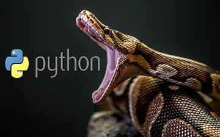

# Fundamentos de Python

## Guia de estudos rápido sobre Python, abordando seus fundamentos até o avançado

A fonte desse conteúdo foi extraída originalmente do curso de [#MaratónLATAM2023_Python_FatecMaua](https://skillsforall.com/course/python-essentials-1?courseLang=pt-BR&instance_id=ddb62d43-4dc1-4ebe-9ea2-2cc3506c703a), mas alguns conhecimentos foram buscados na internet cujas fontes estarão no final do arquivo.

## Conteúdo

1. [O que é Python?](./content/modulo-1.md)
2. [Programando em Python e Tipos de Dados](./content/modulo-2.md)
3. [Fazendo cálculos com Python e Tomada de decisão com Python](./content/modulo-3.md)
4. Booleanos, condicionais, loops, introdução à listas e operações bit a bit
5. Funções, Tuplas, Dicionários de Dados, Exceptions e Processamento de Dados
