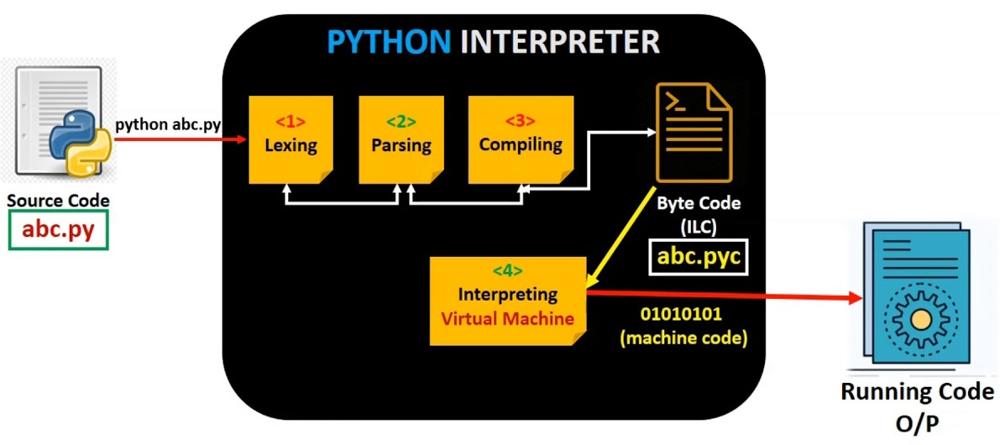

<h1> Modulo 1 - O que é Python </h1>

<h2>Sumário</h2>

- [Definição](#definição)
  - [Linguagem interpretada](#linguagem-interpretada)
  - [Linguagem orientada a objetos](#linguagem-orientada-a-objetos)
  - [Linguagem de alto nível](#linguagem-de-alto-nível)
- [Objetivos do Python](#objetivos-do-python)
- [Porquê aprender Python?](#porquê-aprender-python)
- [Python 2 e Python 3](#python-2-e-python-3)
- [Implementações de Python](#implementações-de-python)
  - [Outras Implementações Python](#outras-implementações-python)
- [Instalando Python](#instalando-python)
- [Bibliografia](#bibliografia)

## Definição

Python é uma linguagem de programação amplamente usada, interpretada, orientada a objeto e de alto nível com sintaxe simples e fácil compreensão, usada para programação de uso geral.

### Linguagem interpretada

Python é geralmente considerada uma linguagem interpretada. No entanto, a implementação padrão do Python, CPython, compila o código fonte em um bytecode intermediário, que é então interpretado pela máquina virtual Python (PVM). Isso significa que o código Python é compilado em tempo de execução, linha por linha, em vez de ser pré-compilado em um executável binário.



Deixo um [artigo](https://www.toptal.com/python/por-que-h-tantos-pythons) que aborda de forma mais completa esse assunto

### Linguagem orientada a objetos

A Programação Orientada a Objetos (POO) é ​​um paradigma de programação baseado no conceito de Classes e Objetos.
Classes podem conter dados (chamado de atributos ou propriedades) e o processamento de códigos (chamado de métodos)

Utilizando o POO e Python, podemos modelar a entidade Pessoa da seguinte forma:

```py
class Pessoa:
  def __init__(self, nome: str, idade: int):
    self.nome = nome
    self.idade = idade

  def se_apresentar(self):
    print(f'Olá, meu nome é {self.nome}. Tenho {self.idade} anos'

  def programar(self, linguagem: str):
    print(f'Estou programando em {linguagem}!')

pessoa = Pessoa(nome='Brendon', idade=18)

pessoa.se_apresentar()
pessoa.programar('Python')
```

Deixo um [artigo](https://pythonacademy.com.br/blog/introducao-a-programacao-orientada-a-objetos-no-python) que aborda de forma mais aprofundada esse assunto

### Linguagem de alto nível

Uma linguagem de alto nível significa que os programadores podem se concentrar mais na **lógica do problema** em si, em vez de se preocuparem com detalhes de baixo nível, como gerenciamento de memória ou manipulação de registros.

Além disso, Python possui uma sintaxe simples e concisa, semelhante à linguagem humana, o que facilita a leitura e o entendimento do código, tornando Python bastante popular se tratando da facilidade de aprender a programar.

```py
# Definindo a lista de números
numeros = [3, 7, 10, 5, 10]

# Calculando a média, utilizando a função sum
soma = sum(numeros)

# usando a função len, que retorna o comprimento da lista
media = soma / len(numeros)

# Imprimindo o resultado
print("A média dos números é:", media)
```

## Objetivos do Python

Em 1999, Guido van Rossum, criador do Python, definiu seus objetivos para o Python:

- uma linguagem **fácil e intuitiva**, tão eficiente quanto a dos grandes concorrentes;
- **código aberto**, para que qualquer pessoa possa contribuir com seu desenvolvimento;
- código tão **compreensível** quanto o simples inglês;
- **adequado para tarefas diárias**, permitindo tempos de desenvolvimento curtos.

## Porquê aprender Python?

- **Fácil de aprender:** o tempo necessário para aprender Python é mais curto do que para muitas outras linguagens

```py
# input
nome = input("Qual é o seu nome?")
# output
print("Olá ", nome)
```

- **Fácil de ensinar:** a carga de trabalho de ensino é menor do que a necessária em outros idiomas; isso significa que o professor pode colocar mais ênfase nas técnicas de programação geral

```py
print("Conjectura de Collatz")
# usuário entra com um número, e converte para um inteiro
x = int(input("Digite um número inteiro diferente de 0 e 1: "))

# enquanto o número for diferente de 1
while x != 1:
    # se o número for par (mod 2 é igual a 0)
    if x % 2 == 0:
        # divida-o por 2
        x /= 2
    # se o número for impar (mod 2 é igual 1)
    else:
        # multiplique-o por 3 e some 1
        x = 3 * x + 1
    print(x)
```

- **Fácil de se usar:** muitas vezes é possível escrever código mais rápido ao usar Python

## Python 2 e Python 3

Existem dois tipos principais de Python, chamados Python 2 e Python 3.**Python 3 é a versão mais recente e usada da linguagem, e é a versão que usaremos nesse guia de estudos**.

Python 2 é uma versão mais antiga do Python original tendo seu desenvolvimento intencionalmente interrompido.
Vale ressaltar que essas duas versões do Python não são compatíveis entre si. Os scripts Python 2 não serão executados em um ambiente Python 3 e vice-versa.

**Se você vai começar um novo projeto Python, deve usar o Python 3**.

## Implementações de Python

Para iniciantes em Pythons, não é muito necessário ter conhecimento sobre suas implementações, **pois por padrão é apenas usado o CPython**, mas vale a curiosidade saber sobre suas outras implementações.

Seguindo a página wiki do Python, uma implementação do Python se refere a **um programa ou ambiente, que oferece suporte para a execução de programas escritos na linguagem Python, conforme representado pela implementação de referência do CPython**.

A implementação tradicional do Python, chamada CPython, é a versão de referência da linguagem de computação Python de Guido van Rossum, e na maioria das vezes é chamada apenas de "Python". Quando você ouve o nome CPython, ele provavelmente é usado para diferenciá-lo de outras implementações alternativas não tradicionais.

### Outras Implementações Python

<details>
<summary>Cython</summary>
<br>
Cython possibilita a adição de tipos estáticos, <b>compilando o código em C para obter um desempenho próximo ao da linguagem C</b>, enquanto mantém a facilidade de desenvolvimento do Python. Com essa implementação, é possível acelerar partes críticas do código Python e integrar-se facilmente com bibliotecas em C existentes, tornando-o uma opção valiosa para melhorar o desempenho de programas em Python.
</details>

<details>
<summary>Jython</summary>
<br>
Jython é executada na máquina virtual Java (JVM). Com o Jython, <b> os desenvolvedores podem aproveitar a interoperabilidade entre Java e Python, permitindo que código Python seja executado em uma plataforma Java </b>. Isso significa que é possível acessar bibliotecas Java, aproveitar a escalabilidade e desempenho da JVM, e integrar facilmente código Python com aplicativos e sistemas Java existentes.
</details>

<details>
<summary>PyPy</summary>
<br>
PyPy <b>busca melhorar o desempenho e a eficiência do tempo de execução</b>. Ao contrário da implementação padrão do CPython, o PyPy utiliza uma técnica chamada compilação just-in-time (JIT), que traduz o código Python em código de máquina otimizado durante a execução. Isso resulta em um desempenho significativamente mais rápido para muitos tipos de aplicativos Python. Além disso, o PyPy também oferece suporte a extensões C e possui um coletor de lixo avançado, o que pode melhorar o gerenciamento de memória e a eficiência geral do programa. Essa implementação é uma opção atraente para desenvolvedores que buscam melhorar o desempenho de suas aplicações Python sem a necessidade de reescrever ou refatorar o código existente.
</details>

<details>
<summary>MicroPython</summary>
<br>
<b>MicroPython é uma implementação projetada para rodar em microcontroladores e sistemas embarcados</b>. Com foco na eficiência e no uso mínimo de recursos, o MicroPython oferece um ambiente de execução leve e compacto, permitindo que programadores utilizem a linguagem Python em dispositivos de baixo consumo de energia.
Originalmente criado por Damien George, um programador australiano que, no ano de 2013, realizou uma campanha bem-sucedida no Kickstarter e lançou a primeira versão do MicroPython com uma placa de desenvolvimento baseada em STM32F4 chamada pyboard.
</details>

## Instalando Python

É possível baixar e instalar o python em <https://www.python.org/downloads/>.

Há muitas maneiras de utilizar o Python, especialmente se você busca se tornar um desenvolvedor de Python.

Para começar o trabalho, você precisa das seguintes ferramentas:

- Um editor de código (IDE) que ajudará você a escrever o código
- Um terminal (console) no qual é possível iniciar o código escrito e interrompê-lo à força quando ele ficar fora de controle;
- Uma ferramenta chamada debugger, capaz de iniciar o código passo a passo, o que permitirá que você inspecione o código a cada momento de execução.

Também é possível testar o Python nos navegadores, utilizando ferramentas online que são capazes de interpretar python, por exemplo: <https://www.online-python.com/>

## Bibliografia

<https://pt.wikipedia.org/wiki/Python]>
