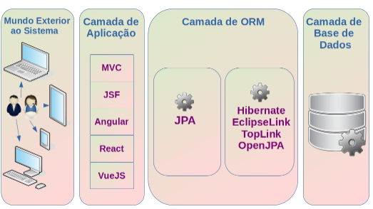

<h1> Persistência de dados com JPA e JDBC</h1>

<h2> Sumário </h2>

- [O que é JDBC (Java EE Database Connectivity)](#o-que-é-jdbc-java-ee-database-connectivity)
- [O que é JPA (Java Persistence API)](#o-que-é-jpa-java-persistence-api)
  - [O que são POJO](#o-que-são-pojo)
- [Hibernate](#hibernate)
  - [O que é ORM](#o-que-é-orm)

## O que é JDBC (Java EE Database Connectivity)

- O **Java EE Database Conenctivity (JDBC)** é uma API que permite aplicações Java conectar e manipular **banco de dados relacionais**
- Ele realiza a interpretação e a conversão dos comandos necessários para a manipulação do banco de dados
- Há drivers diferentes para cada banco de dados (MySQL, PostgreSQL, SQL Server) no qual o JDBC utiliza para converter o código Java na sintaxe que o RDMS (SGBD) utiliza

## O que é JPA (Java Persistence API)

- o **Java Persistence API (JPA)** é um framework baseado em POJOs (Plain Old Java Object), que são entidades, usado na camada de persistência de uma aplicação para persistir dados dentro de uma aplicação
- Ela é uma API criada para ser uma especificação de como os frameworks ORM devem ser implementados para prover a persistência de dados em banco de dados relacionais



### O que são POJO

- Um **POJO (Plain Old Java Object)** é uma classe simples em Java que geralmente é usada para representar dados e não possui regras de negócios específicas. No Kotlin, uma abordagem semelhante ao de um POJO é a `data class`.
- Não dependem da herança de interfaces ou classes dde frameworks externos

Exemplo de um POJO:

```java
public class User {
    private String username;
    private String email;

    public User() {
    }

    public User(String username, String email) {
        this.username = username;
        this.email = email;
    }

    public String getUsername() {
        return username;
    }

    public void setUsername(String username) {
        this.username = username;
    }

    public String getEmail() {
        return email;
    }

    public void setEmail(String email) {
        this.email = email;
    }

    @Override
    public String toString() {
        return "User [username=" + username + ", email=" + email + "]";
    }
}
```

Com a sintaxe do kotlin:

```kotlin
data class User(val username: String, val email: String)
```

## Hibernate

- O Hibernate é um framework de ORM para persistência de dados em projetos Java no qual implementa a especificação JPA

### O que é ORM

- Um **Object Relational Mapper (ORM)**, que significa mapeamento de objeto-relacional, é um conjunto de ferramentas que facilita a comunicação entre um banco de dados e uma linguagem de programação orientada a objetos
- Ele agiliza o processo de manipulação de um banco de dados, automatizando a persistência de dados em um banco de dados, convertendo os dados de objetos para as tabelas
