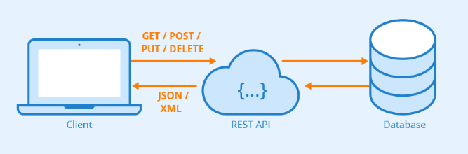

<h1> Introdução à APIs RESTful </h1>

<h2> Sumário </h2>

## O que é uma API (Application Programming Interface)

- API é um termo bastante amplo utilizado para se referir às aplicações que são utilizadas como interfaces, servindo de intermediárias que permitem um aplicativo se comunicar com o outro, como se fosse um contrato de serviço
- A documentação de APIs é muito fundamental para que os desenvolvedores saibam como estruturar as solicitações e respostas da uma API
- A arquitetura da API é explica em termos de **cliente** e **servidor**: A aplicação que envia a solicitação (**cliente**) espera que outra aplicação retorne uma resposta (**servidor**)

## O que significa ser REST

REST é uma arquitetura de API utilizada para desenvolver serviços web, no qual o cliente envia solicitações ao servidor como **requisição**, com base nela o servidor usa para fazer procedimentos internos e retornar uma **resposta**. Uma API que adota os padrões REST é chamada de RESTful

- REST significa **Transferência Representacional de Estado**.
- Clientes e Servidores trocam dados usando os métodos do protocolo HTTP (GET, POST, PATCH, PUT, DELETE, etc)
- A API REST não guarda estado durante a sua transferência de dados, ela é ***stateless***

### Requisição (Request) da API REST

Uma requisição é feita pelo cliente para solicitar uma operação específica no servidor. Ela contém informações sobre a ação desejada e, em alguns casos, dados adicionais. As requisições RESTful são baseadas nos métodos HTTP, por exemplo:

- **GET:** Solicita a recuperação de dados de um recurso no servidor
- **POST:** Envia dados para o servidor para criar um novo recurso (dados do recurso estão no *body* da requisição)
- **DELETE:** Solicita a remoção de um recurso no servidor
- **PATCH:** Atualiza parcialmente um recurso existente no servidor
- **PUT:** Atualiza um recurso existente no servidor

Também, dentro da requisição pode conter:

- **Cabeçalhos (Headers):** Informações adicionais sobre a requisição, como o tipo de conteúdo aceito ou informações de autenticação.
- **Corpo (Body):** Dados adicionais enviados com a requisição, geralmente usado em requisições POST, PUT e PATCH para o envio de dados

### Reposta (Response) da API REST

A resposta é o que o servidor retorna após processar a requisição. Ela contém informações sobre o resultado da operação solicitada.

- **Código de Status (Status Code):** Um código de três dígitos que indica o resultado da operação. (recomendo ver o site <https://www.httpstatus.com.br/>)
- **Cabeçalhos:** Assim como nas requisições, os cabeçalhos da resposta fornecem informações adicionais, como o tipo de conteúdo retornado
- **Corpo (Body):** Contém os dados retornados pelo servidor, geralmente em formato de JSON.
