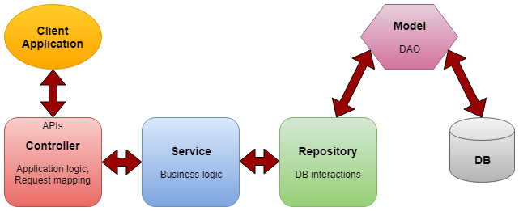

<h1> O que é Spring Framework </h1>

<h2> Sumário </h2>

- [O que é Spring Framework para desenvolver APIs](#o-que-é-spring-framework-para-desenvolver-apis)
- [Arquitetura de uma Web API no Spring](#arquitetura-de-uma-web-api-no-spring)
- [Iniciando com Spring Boot](#iniciando-com-spring-boot)

## O que é Spring Framework para desenvolver APIs

- O Spring é um framework Java open-source baseado nos *design patterns* (padrões de projetos) de Injeção de dependências (DI) e inversão de controle (IoC)
- Foi criado com o propósito de facilitar o desenvolvimentos de aplicações
- O Spring Boot é outra ferramenta que traz uma maior agilidade para o processo de desenvolvimento, trazendo inicialmente várias configurações de *setup*

## Arquitetura de uma Web API no Spring

A Arquitetura se uma API web feita no spring baseia-se nas seguintes **camadas**:

- **Controller**: Responsável por manipular todas as rotas das requisições feitas pelo cliente por meio de uma *endpoint*. Requisições feitas através de URL's usando o protocolo HTTP
- **Service**: Responsável pela regra de negócio e a tratativa de dados
- **Repository (Data Access Object - DAO)**: É a interface responsável por se comunicar com o banco de dados
- **Configuration**: Camada responsável por implementar configurações específicas a aplicação
- **Security**: Camada responsável por implementar a segurança na aplicação

## Iniciando com Spring Boot

Para poder iniciar uma aplicação com o spring boot, é recomendado usar o [Spring Initializr](https://start.spring.io/) que provê uma interface simples no qual é possível ajustar as configurações iniciais do projeto: a linguagem de programação utilizada, a versão do spring boot, versão do java e as dependências que serão utilizadas na aplicação

As configurações do spring boot, isto é, suas dependências, são ajustadas no arquivo de configuração `application.properties` (ou `application.yml`)
