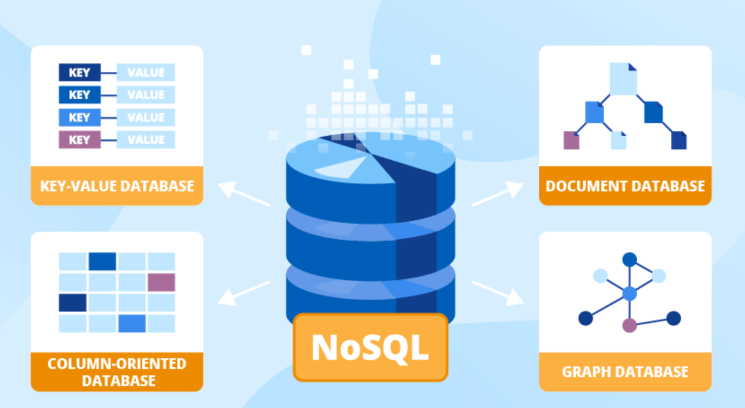

# O que é NoSQL (Not Only SQL)

- **NoSQL** refere-se aos banco de dados não relacionais, ou seja que **não são apenas** SQL (***Not Only SQL***), não seguindo o modelo de tabelas e relacionamentos comuns à banco de dados relacionais. Por isso o nome NoSQL
- Em comparação aos banco de dados relacionais, eles são projetados para lidar com **alto volume de dados** (big data e IoT por exemplo), lidando com alta escalabilidade.
- Os seus esquemas possuem maior flexibilidade na estrutura de dados, por isso são amplamente utilizados em contextos onde a **consistência imediata** dos dados não é crítica

## Tipos de NoSQL

### Key-Value (Chave-Valor)

- **Características e Uso Comum:** Armazena pares chave-valor ondde cada chave é um Identificador para operações rápidas, como em armazenamento em cache.
- **Exemplo:** Amazon DynamoDB, Redis

### Document (Documento)

- **Características e Uso Comum:** Armazena dados em documentos semiestruturados (JSON/BSON) para esquemas dinâmicos, como em aplicativos web.
- **Exemplo:** Amazon DocumentDB, MongoDB, Apache CouchDB

### Columnar (Colunar)

- **Características e Uso Comum:** Armazena dados por coluna, eficiente para análises em data warehouses e business intelligence.
- **Exemplo:** Apache Cassandra, HBase

### Graph (Grafo)

- **Características e Uso Comum:** Modela dados em grafos (nós e arestas) para representar relações complexas, como em redes sociais.
- **Exemplo:** Amazon Neptune, Neo4j
