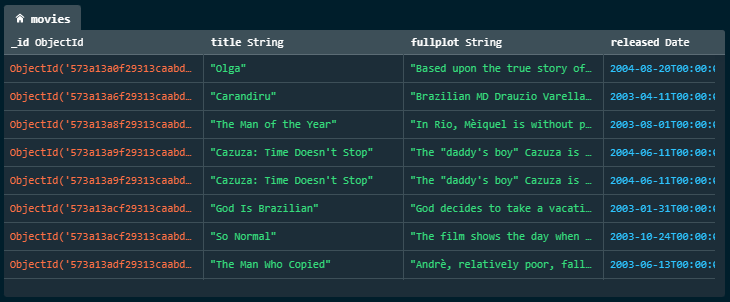

<h1> Operações no MongoDB </h1>

<h2> Sumário </h2>

- [Criando um Banco de Dados e uma Collection](#criando-um-banco-de-dados-e-uma-collection)
- [Inserção de documentos](#inserção-de-documentos)
- [Consulta de documentos](#consulta-de-documentos)
  - [Consulta simples de igualdade](#consulta-simples-de-igualdade)
  - [Operadores de Comparação de consultas](#operadores-de-comparação-de-consultas)
  - [Operadores Lógicos de consultas](#operadores-lógicos-de-consultas)
- [Definindo os campos da consulta (Projeção)](#definindo-os-campos-da-consulta-projeção)
- [Ordenação de documentos](#ordenação-de-documentos)
- [Paginação e Limitação de resultados](#paginação-e-limitação-de-resultados)
- [Exclusão de Documentos](#exclusão-de-documentos)
- [Bibliografia](#bibliografia)

## Criando um Banco de Dados e uma Collection

Tecnicamente não existe um comando pré-definido de "criação" de banco de dados. Para essa operação usa-se o comando `use <db_name>`, no qual é alterado o banco de dados que está sendo usado atualmente. Por exemplo:

```bash
use viagens_db
```

Para criar uma collection usa-se o comando `db.createCollection("collection_name")`

```bash
db.createCollection("usuarios")
```

## Inserção de documentos

Para a inserção de documentos dentro de uma collection usa-se o comando `db.nome_collection.insertOne({})`, para a inserção de vários documentos usa-se o comando `db.nome_collection.insertMany([{}])`. Por exemplo:

```bash
db.usuarios.insertOne({
  "name": "John Doe",
  "email": "john@email.com"
})
```

É criado então dentro do MongoDB o seguinte documento:

```json
{
  "_id": {
    "$oid": "65809e7556ad0a7b69b0ad6b" // ObjectId
  },
  "name": "John Doe",
  "email": "john@email.com"
}
```

Para a inserção de vários documentos utiliza-se o comando insertMany em vez do insertOne, no qual é passado como um parâmetro um array de vários documentos

```bash

db.usuarios.insertMany([
  {
    "name": "John Doe",
    "email": "john@email.com"
  },
  {
  "name": "Jane Doe",
  "email": "jane@email.com"
  }
]);
```

## Consulta de documentos

> A documentação do MongoDB disponibiliza vários bancos de dados para serem testados livremente, [clique aqui para abrir o link da documentação](https://www.mongodb.com/docs/atlas/sample-data/). As consultas abaixo serão aplicadas nesse banco de dados

É possível utilizar os seguintes comandos do MongoDB para fazer a consulta de documentos, dentro das chaves é inserido os parâmetros de consulta do MongoDB:

- `db.movies.find({})`: consultar todos os documentos
- `db.movies.findOne({})`: consultar e retornar apenas um documento
- `db.movies.findOneAndUpdate({})`: será consultado e será atualizado o documento (utiliza-se o operador `$set`)
- `db.movies.findOneAndDelete({})`: será consultado e será apagado o documento

```bash
# Procurar por todos os filmes lançados
db.movies.find({})
```

### Consulta simples de igualdade

Para fazer uma consulta baseada em um valor definido para um campo basta definir o campo e o valor que se deseja. Por exemplo:

```bash
# Procurar por filme que o título seja "City of God"
db.movies.find({ title: 'City of God' })
```

### Operadores de Comparação de consultas

Para fazer consultas que compara determinados valores aos documentos, utiliza-se operadores de comparação:

- `$ne` (*not equals* - **diferente**)
- `$gt` (*greater than* - **maior que**),
- `$lt` (*lower than* - **menor que**),
- `$gte` (*greater than or equals* - **maior ou igual a**),
- `$lte` (*lower than or equals* - **menor ou igual a**),
- `$in` (*in an array* - **pertence a uma lista**):
- `$nin` (*not in an array* - **não pertence a uma lista**),

Por exemplo:

```shell
# definir o banco de dados que será utilizado
use sample_mflix

# retornar todos os filmes que têm o idioma "Português", a data dde lançamento seja 2003 ou 2004 e
# que foi seja um filme brasileiro (veja a imagem do resultado abaixo)
db.movies.find({
  languages: "Portuguese",
  year: {$in: [2003, 2004]},
  countries: {$eq: "Brazil"}
})
```



### Operadores Lógicos de consultas

Para fazer consultas filtrando através de condições definidas, é utilizado operadores lógicos:

- `$and`: filtrar por várias condições
- `$or`: filtrar por possíveis condiçõe
- `$not`: filtrar por aquelas que não satisfaçam a condição definida

## Definindo os campos da consulta (Projeção)

Para definir os campos que devem ser retornados na consulta usa-se a projeção. Por exemplo:

```bash
# o projection é o segundo parâmetro do find
# pode ser utilizado 1 ou true
db.movies.find({}, {title: true, released: true, plot: true, poster: true, imdb: true})
```

## Ordenação de documentos

Para definir a ordenação dos documentos de uma consulta usa-se

## Paginação e Limitação de resultados

Para limitar o número de documentos retornados usa-se o método `limit()`. Por exemplo:

```bash
db.movies.find({}).limit(5)
```

Para retornar documentos com base em páginas (de 10 em 10 por exemplo) usa-se os métodos `skip()` e `limit()`. Por exemplo:

```bash
# skip(10), skip(20) e assim por diante
db.movies.find({}).limit(10).skip(10)
```

## Exclusão de Documentos

Para remover documentos no MongoDB usa-se os comandos `db.usuarios.deleteOne({<critérios>})` ou o `db.usuarios.deleteMany({})` para a remoção de vários documentos.

## Bibliografia

- [Operadores de Comparação de Consulta - MongoDB](https://www.mongodb.com/docs/manual/reference/operator/query-comparison/)
- [Consultando e Filtrando dados - MongoDB](https://www.mongodb.com/docs/compass/current/query/filter/?utm_source=compass&utm_medium=product#match-by-multiple-conditions---and-)
