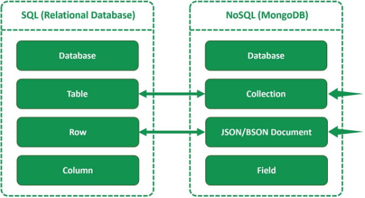

<h1> Estrutura e modelagem de dados no MongoDB </h1>

<h2> Sumário </h2>

- [Estrutura do MongoDB](#estrutura-do-mongodb)
- [Modelagem de Dados no MongoDB](#modelagem-de-dados-no-mongodb)

## Estrutura do MongoDB

A estrutura do banco de dados do MongoDB é composta da seguinte forma:

- **Banco de dados:** podemos dizer que é a instância do banco de dados em si
- **Coleções:** São como se fosse as tabelas, são um agrupamento lógico de documentos, não exigindo um esquema pré-definido
- Documentos:
, um banco de dados possui várias coleções (são como tabelas), que possuem vários documentos ()

## Modelagem de Dados no MongoDB

- A modelagem de dados no MongoDB deve ser orientada pelas consultas (query) que serão realizadas com mais frequência
- É comum **desnormalizar** os dados, para evitar operações de junção (joins no SQL) custosas. Ou seja, os dados relacionados poem ser armazenados juntos em um único **document**, em vez e serem distribuídos em várias coleções.
