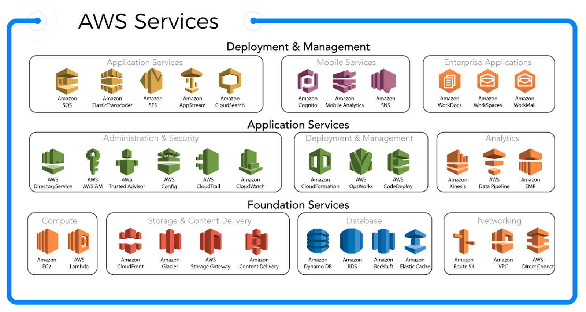

<h1> Introdução de Fundamentos de AWS </h1>

A AWS fornece **serviços** e computação em nuvem. Recursos de TI que antes sua provisão era demorada e custosa, pode ser provisionada em segundos com a computação em nuvem moderna. Com a AWS você consegue:

- Provisionar uma infraestrutura **escalável** (**elasticidade** na terminologia da AWS)
- Criar aplicações altamente disponíveis utilizando de recursos como: **Load balancers** e **zonas de disponibilidade** que estão em regiões, possibilitando a **redundância de dados** (replicação dos recursos em várias zonas distintas da mesma região), possibilitando a **tolerância a falhas**
- Pagar apenas pela infraestrutura que utiliza (**pay as-you-go**), facilitando a implantação de novos recursos ou o desligamento de recursos que não estão sendo utilizados
- Gerenciar o controle do acesso aos recursos e administrar **quem** tem acesso a **quais** recursos através de políticas e permissões (utilizando o Identity Access Management)
- Monitorar o **desempenho de recursos** podendo criar alertas para quando haver aumento no acesso aos recursos ou quanto atingir métricas pré determinadas

<h2> Sumário </h2>

- [O que é computação na nuvem](#o-que-é-computação-na-nuvem)
- [Modelos de Computação](#modelos-de-computação)
- [Escalabilidade e Elasticidade](#escalabilidade-e-elasticidade)
  - [Escalabilidade](#escalabilidade)
  - [Elasticidade](#elasticidade)
- [Disponibilidade](#disponibilidade)
  - [Região](#região)
  - [Zona de disponibilidade - AZ](#zona-de-disponibilidade---az)
  - [Ponto de Presença](#ponto-de-presença)
- [Serviços gerais do AWS](#serviços-gerais-do-aws)

## O que é computação na nuvem

> É a entrega sob demanda de recursos computacionais, através de uma plataforma de serviços via Internet, sem o gerenciamento ativo do usuário

Atualmente muitas empresas buscam migrar para o ambiente cloud, sendo algumas das razões para essas migrações:

- Reduzir custos
- Reduzir Infraestrutura física (On Premises)
- Economizar dinheiro da corporação
- Para não ter que lidar com suposições na implementação um datacenter (lidar com recursos que estão ociosos ou com capacidade limitada)
- Despesas variáveis (sob demanda)
- Grandes economias em escala (a nuvem oferece serviços de gestão e faturamento)
- Aumentar a velocidade e agilidade de toda aplicação
- Tornar-se global

Ainda hoje há modelos de turnos de 20/7, no qual ficam monitorando o cloud 24 horas

## Modelos de Computação

Define qual é sua responsabilidade, e qual é do do provedor da nuvem AWS

- Modelo Tradicional: On Premises
- **Infraestrutura como Serviço** (IaaS) para **Hospedar**: AWS cuida da infraestrutura como um todo (Network, Storage, Servers), com você cuidando do Sistema Operacional, Banco de Dados (EC2).
- **Plataforma como Serviço** (PaaS) para **Programar**: AWS cuida do Sistema Operacional (Amazon RDS)
- **Software como Serviço** (SaaS) para **Usar**: Você só cuida dos dados que são sendo manipulados pelo sistema (Auto Scaling)

## Escalabilidade e Elasticidade

Exemplo para estudo: No contexto de construir um terreno para moradia, ao escalar horizontalmente você adiciona **novas** moradias (**escalabilidade**), escalando verticalmente você adiciona novos andares para a mesma moradia (**elasticidade**)

### Escalabilidade

É sobre expandir horizontalmente (quantidade), para para ser **tolerante a falhas**

- Amazon EC2 Auto Scaling
  - O significado de Amazon EC2 é Amazon Elastic Compute Cloud
- É sobre o sistema ser capaz de escalar sob demanda (pico de uso) e ser tolerante a falhas, ter mais capacidade computacional.
- Você define um número **mínimo**, **desejado** e o **número máximo** de computadores EC2
- Com isso você: **melhora a disponibilidade** da aplicação; Obtêm um ambiente tolerante a falhas; Essa abordagem reflete nos custos operacionais, você só paga conforme o uso

### Elasticidade

- É sobre expandir verticalmente (capacidade) o recurso computacional, **distribuir carga de trabalho**
- Capacidade de expandir para se adaptar à outra forma

## Disponibilidade

### Região

Uma **Região** é a disponibilização de uma coleção de recursos AWS em **localização geográfica**, sendo ele composto por um **conjunto de zonas de disponibilidade** (são Clusters de AZ).

Para escolher uma região é necessário considerar os fatores:

- **Conformidade de dados (compliance)**: regulamentações que determinam o território no qual os dados deverão ser armazenados
- **Latência**: distância entre os recursos e os usuários que utilizarão os recursos
- **Preço**: podem varias entre regiões
- **Disponibilidade de serviço**: se o serviço é disponível para ser implantado na região desejada

### Zona de disponibilidade - AZ

- Uma **Zona de disponibilidade** (Availability Zone - AZ) é um ou mais datacenters que estão na mesma Região, porém separados por uma distância significativa, **atuando de forma independente** em caso de falha de uma zona
- São conectas com alta velocidade, com segurança local, refrigeração e rede
- São **redundantes** entre si via conectividade, rede e energia

### Ponto de Presença

- **Points of Presence** ou **Edge Locations** (locais de borda)
- É uma infraestrutura de servidores, localizado próximo de uma Zona de disponibilidade, que **armazena os dados** mais solicitados no **cache**, para entregar com **menor latência** uma requisição de consulta
- São utilizados como **cache de dados** para **distribuição de conteúdo**

## Serviços gerais do AWS

