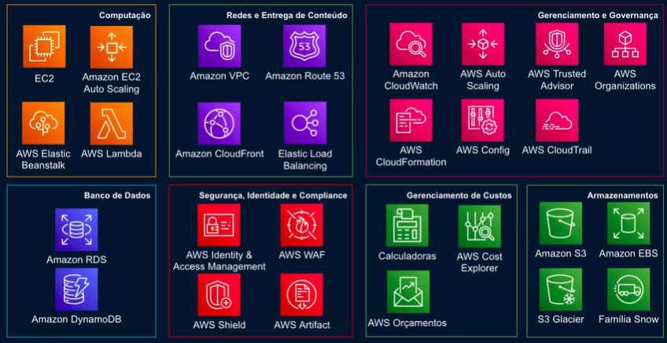

<h1> Introdução de Fundamentos de AWS </h1>

<h2> Sumário </h2>

- [O que é computação na nuvem](#o-que-é-computação-na-nuvem)
  - [Pilares (Vantagens) da AWS](#pilares-vantagens-da-aws)
- [Modelos de computação](#modelos-de-computação)
- [Escalabilidade e Elasticidade](#escalabilidade-e-elasticidade)
  - [Escalabilidade](#escalabilidade)
  - [Elasticidade](#elasticidade)
- [Disponibilidade](#disponibilidade)
  - [Região](#região)
  - [Zona de disponibilidade - AZ](#zona-de-disponibilidade---az)
  - [Ponto de Presença](#ponto-de-presença)
- [Serviços gerais do AWS](#serviços-gerais-do-aws)

## O que é computação na nuvem

> É a entrega sob demanda de recursos computacionais, através de uma plataforma de serviços via Internet, sem o gerenciamento ativo do usuário

Hoje muitas empresas buscam migrar para o ambiente em nuvem, algumas das razões para essas migrações:

### Pilares (Vantagens) da AWS

- **Save Money** - Reduzir custos e Infraestrutura física
- **Stop Guessing** - Não ter que lidar com suposições na implementação um datacenter (lidar com recursos que estão ociosos ou com capacidade limitada)
- **Variable Expenses** - Pague conforme com o uso, diminui o TCO (sem posses), diminui CapEx e transforma em OpEx - despesas fixas para variáveis
- **Economies of Scale** - Economizar dinheiro da corporação (a nuvem oferece serviços de gestão e faturamento)
- **Increase Speed and Agility** - Aumentar a velocidade e agilidade de toda aplicação e de se produzir uma infraestrutura
- **Go Global** - Tornar-se global em segundos (infraestrutura disponível em todo globo)

Ainda hoje há modelos de turnos de 20/7, no qual ficam monitorando o cloud 24 horas

## Modelos de computação

> É necessário saber sobre modelos de computação, para saber modelo você entregar deve entregar para o tipo de negócio desejado e qual o mais apropriado no seu devido contexto

Define qual é sua responsabilidade, e qual é a responsabilidade do provedor da nuvem AWS

- **Modelo Tradicional (On Premises):** Ambiente 100% gerenciado por você
- **Infraestrutura como Serviço (IaaS)** para `Hospedar`: AWS cuida da infraestrutura como um todo (Network, Storage, Servers), com você cuidando do Sistema Operacional, Banco de Dados
  - EC2 (Virtual Machines)
- **Plataforma como Serviço (PaaS)** para `Programar`: AWS dá manutenção sobre as SOs, AWS cuida do Sistema Operacional (Amazon RDS)
  - AWS Elastic Beanstalk (Ambiente para o fácil deploy de aplicações)
- **Software como Serviço (SaaS)** para `Utilizar`: Você só cuida dos dados que são sendo manipulados pelo sistema
  - G-mail e outros serviços de e-mail
  - Amazon Rekognition (ML para análise de imagens e vídeo)

## Escalabilidade e Elasticidade

Exemplo para estudo: No contexto de construir um terreno para moradia, ao escalar horizontalmente você adiciona **novas** moradias (**escalabilidade**), escalando verticalmente você adiciona novos andares para a mesma moradia (**elasticidade**)

- **Escalabilidade** - escalar horizontalmente - aumentar/diminuir a quantidade
- **Elasticidade** - escalar verticalmente - aumentar/diminuir os recursos computacionais

### Escalabilidade

> Crescer de acordo com a capacidade desejada (métricas definidas - mínimo, desejado, máximo e o disponível para escalonar)

É sobre **expandir horizontalmente** (quantidade), para para ser **tolerante a falhas**

- Amazon EC2 Auto Scaling
  - Você define um número **mínimo**, **desejado** e o **número máximo** de instâncias EC2
- Capacidade de crescer ou diminuir sob demanda (pico de uso) e ser tolerante a falhas, para ter alta disponibilidade.
- Com isso você: **melhora a disponibilidade** da aplicação; Obtêm um ambiente tolerante a falhas; Essa abordagem reflete nos custos operacionais, você só paga conforme o uso

### Elasticidade

- É sobre **expandir verticalmente** (capacidade) o recurso computacional, **distribuir carga de trabalho**
- Capacidade de expandir para se adaptar à outra forma
- Amazon EC2, Elastic Load Balancing, Elastic Beanstalk, Elastic Cache

## Disponibilidade

### Região

Uma **Região** é conjunto de data centers (recursos da AWS) em uma **localização geográfica**, sendo ele composto por um **conjunto de zonas de disponibilidade** (Clusters de AZ).

Para escolher uma região é necessário considerar os fatores:

- **Conformidade de dados (compliance):** regulamentações que determinam o território no qual os dados deverão ser armazenados
- **Latência:** distância entre os recursos e os usuários que utilizarão os recursos
- **Preço:** podem varias entre regiões
- **Disponibilidade de serviço:** se o serviço é disponível para ser implantado na região desejada

### Zona de disponibilidade - AZ

- Uma **Zona de disponibilidade** (Availability Zone - AZ) é um ou mais datacenters que estão na mesma Região, porém separados por uma distância significativa, **atuando de forma independente** em caso de falha de uma zona
- São conectas com alta velocidade, com segurança local, refrigeração e rede
- São **redundantes** entre si via conectividade, rede e energia

> Com uma estratégia Multi-AZ é possível aumentar a disponibilidade e prevenir um único ponto de falha da aplicação.

### Ponto de Presença

- **Points of Presence** ou **Edge Locations** (locais de borda)
- É uma infraestrutura de servidores, localizado próximo de uma Zona de disponibilidade, que **armazena os dados** mais solicitados no **cache**, para entregar com **menor latência** uma requisição de consulta
- São utilizados como **cache de dados** para **distribuição de conteúdo**
  - Utilizado por: CloudFront

## Serviços gerais do AWS

