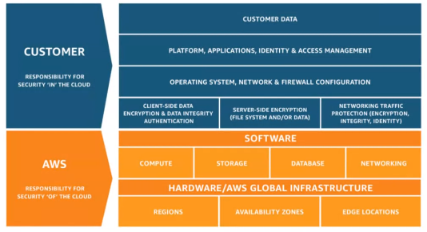
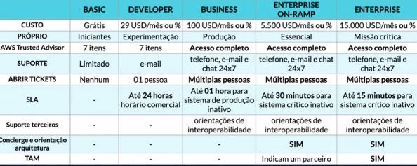

<h1> Console Gerenciamento & Gerenciamento Custos </h1>

<h2> Sumário </h2>

- [Serviços Regionais](#serviços-regionais)
- [Serviços Globais](#serviços-globais)
- [Modelo de responsabilidade Compartilhada](#modelo-de-responsabilidade-compartilhada)
- [Recurso gerenciado](#recurso-gerenciado)
- [3 Níveis (tipos de ofertas) Gratuitos da AWS](#3-níveis-tipos-de-ofertas-gratuitos-da-aws)
- [Planos de Suporte](#planos-de-suporte)
- [Interfaces de Acesso (API)](#interfaces-de-acesso-api)
- [AWS Budget (Criando um orçamento)](#aws-budget-criando-um-orçamento)
- [AWS Cost Explorer](#aws-cost-explorer)
- [AWS Pricing Calculator](#aws-pricing-calculator)

## Serviços Regionais

- **Computação:** EC2; AWS Lambda; AWS Elastic Beanstalk; Amazon EC2 Auto Scaling
- A única região que tem disponibilidade de EC2 é no brasil (são paulo)

## Serviços Globais

- **Redes e Entrega de Conteúdo:** Amazon CloudFront; Amazon Route 53;
- **Segurança, Identidade e Compliance:** AWS Identity & Access Management; AWS WAF

## Modelo de responsabilidade Compartilhada

Utilizado para definir os limites, sendo o que é físico, responsabilidade da AWS, os dados de cliente é responsabilidade do cliente

A **AWS** gerencia a **segurança DA nuvem** - `Security OF the cloud`

Você é responsável pela **segurança NA nuvem** - `Security IN the cloud`.

## Recurso gerenciado

- **Recurso gerenciado:** quando um serviço ou as configurações da camada anterior não são administrados pelo **usuário**, mas sim pela AWS.
- Um recurso deixa de ser gerenciado por você quando a outra parte inicia o gerenciamento, as atualizações, a manutenção do sistema operacional e a segurança.

---

## 3 Níveis (tipos de ofertas) Gratuitos da AWS

- **12 Meses Gratuitos:** A partir da criação do cadastro (free tier)
  - 750 hrs do EC2 (mas t2.micro)
- **Testes:** Período limitado; Avaliação de testes
  - Amazon SageMaker (2 meses de avaliação)
- **Sempre gratuitos:** Não expiram; Disponível para todos os clientes; Tem um limite de uso
  - Amazon AutoScaling
  - Amazon DynamoDB - até 25 GB de armazenamento
  - AWS Lambda - 1 milhão de request

## Planos de Suporte

- `CASE de suporte técnico` (tickets de suporte) não são oferecidos no plano **Básico**
- Trusted Advisor completo somente nos planos `Business`, `Enterprise On-Ramp` e `Enterprise`
- Suporte em até 15 minutos, apenas no plano Enterprise
- Concierge apenas nos planos On-Ramp e Enterprise
- TAM (gerente técnico da conta) apenas nos planos Enterprise, no OnRamp eles indicam um parceiro

## Interfaces de Acesso (API)

- **AWS Management Console:** interface via https & app **(AWS Console Mobile App)**
- **Command Line Interface (CLI):** via terminal, é um client que pode ser acessado pelo browser ou instalado localmente
- **Software Development Kit (SDK):** kits para developers utilizarem da sua linguagem de programação para conversar com os serviços AWS, via **API**, programação

## AWS Budget (Criando um orçamento)

> O AWS Budgets (Orçamentos da AWS) permite que você defina **orçamentos personalizados** e **enviar alertas** quando o uso ou os custos excede o valor orçado.

- Você escolhe o meio de aviso (**e-mail** ou **notificação do SNS** (*Amazon Simple Notification Service*)) quando o custo real ou previsto e o uso excederem o limite do orçamento criado

## AWS Cost Explorer

> É uma interface (dashboard), para visualizar e gerenciar os custos e uso da AWS ao **longo do tempo**.

- Você usa o serviço de **Cost Explorer** para visualizar os relatórios e baixar os relatórios em modelo CSV
- Não bloqueia o uso após extrapolação do uso
- Para outros bloqueios em relação ao uso de dados, usa-se outras ferramentas como o **AWS Lambda** para automação de limpeza (inativação) de recursos inutilizados do AWS.

## AWS Pricing Calculator

> Fazer uma estimativa do custo dos recursos e serviços do projeto. Que informa um custo mensal e um custo anual da estimativa (valor em dólar)
