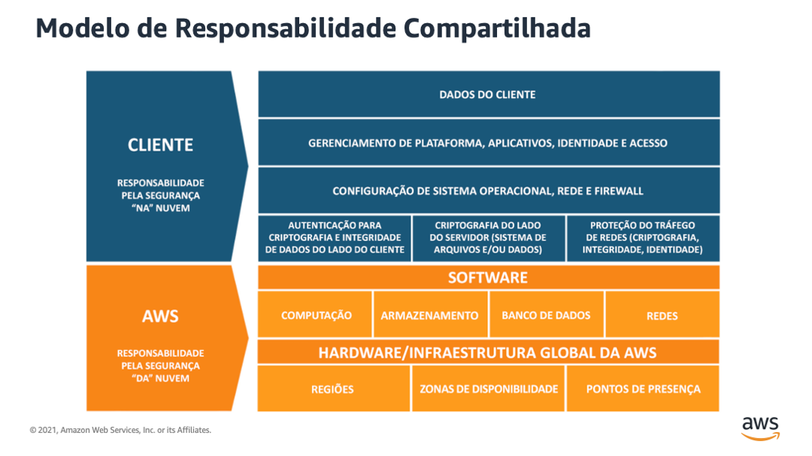

# Console Gerenciamento & Gerenciamento Custos

A única região que tem disponibilidade de EC2 é no brasil (são paulo)

## Serviços Regionais

- **Computação**: EC2; AWS Lambda; AWS Elastic Beanstalk; Amazon EC2 Auto Scaling

## Serviços Globais

- **Redes e Entrega de Conteúdo**: Amazon CloudFront; Amazon Route 53;
- **Segurança, Identidade e Compliance**: AWS Identity & Access Management; AWS WAF

## Responsabilidade Compartilhada

Definir os limites, o que é físico é da AWS, os dados de cliente é responsabilidade do cliente

Enquanto a **AWS** gerencia a **segurança DA nuvem** (**Security OF the cloud**), você é responsável pela **segurança NA nuvem** (**Security IN the cloud**).

- **Recurso gerenciado**: quando um serviço ou as configurações da camada anterior não são administrados pelo **usuário**.
- Um recurso deixa de ser gerenciado por você quando a outra parte inicia o gerenciamento, os updates, a manutenção do SO e a segurança.

## 3 Níveis (tipos de ofertas) Gratuitos da AWS

- Serviços para testes Gratuitos
- Serviços de 12 Meses Gratuitos (free tier) (Amazon DynamoDB até 25GB)
- Serviços que são sempre gratuitos (auto scaling)

## Planos de Suporte

- **CASE** de suporte técnico não são oferecidos no plano **Básico**
- Trusted Advisor completo somente nos planos Business, Enterprise On-Ramp e Enterprise
- Suporte em até 15 minutos, apenas no plano Enterprise
- Concierge apenas nos planos On-Ramp e Enterprise
- TAM (gerente técnico da conta) apenas nos planos Enterprise, porque no OnRamp eles indicam um parceiro

## Interfaces de Acesso (API)

- **AWS Management Console**: interface via https & app
- **Command Line Interface (CLI)**: um terminal, é um client que pode ser acessado pelo browser ou instalado localmente
- **Software Development Kit (SDK)**: kits para developers utilizarem da sua linguagem de programação para conversar com os serviços AWS, via **API**, programação

## AWS Budget (Criando um orçamento)

O AWS Budgets (Orçamentos da AWS) permite que você defina **orçamentos personalizados** e **enviar alertas** quando o uso ou os custos excede o valor orçado.

- Você escolhe o meio de aviso (**e-mail** ou **notificação SNS** -*Amazon Simple Notification Service*) quando o custo real ou previsto e o uso excederem o limite do orçamento criado

## AWS Cost Management

É uma interface (dashboard), para visualizar e gerenciar os custos e uso da AWS ao **longo do tempo**.

- Exemplo: Cost Explorer para visualizar os relatórios e baixar os relatórios em modelo CSV
- Não bloqueia o uso após extrapolação do uso
- Para outros bloqueios em relação ao uso de dados, usa-se outras ferramentas como o **AWS Lambda** para automação de limpeza (inativação) de recursos inutilizados do AWS.

## AWS Pricing Calculator

Fazer uma estimativa do custo de um recurso/serviço (em dólar). Que informa um custo mensal e um custo anual
