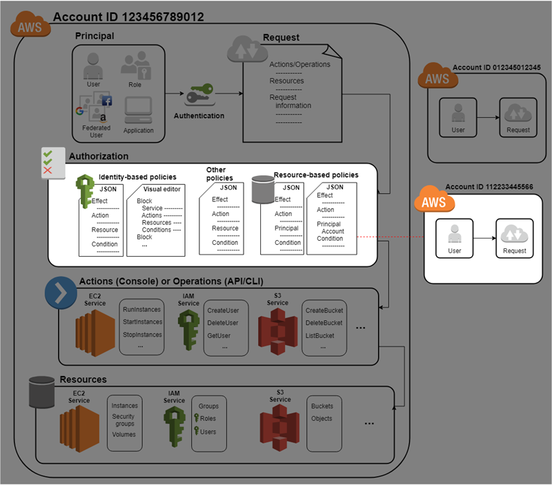
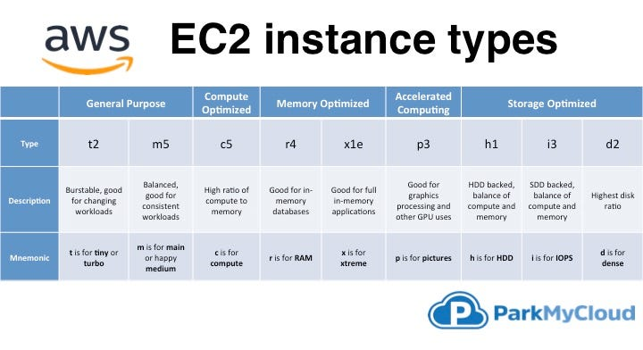
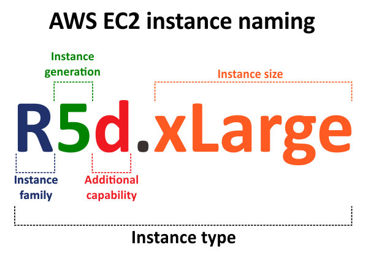

<h1> Identidade, Segurança & Computação </h1>

<h2> Sumário </h2>

- [Usuário Root (Raiz)](#usuário-root-raiz)
  - [MFA - Multi-factor Authentication](#mfa---multi-factor-authentication)
- [Identidade - AWS Identity and Access Management](#identidade---aws-identity-and-access-management)
  - [User Groups \& Roles](#user-groups--roles)
  - [Autenticação e Autorização](#autenticação-e-autorização)
  - [Regras gerais](#regras-gerais)
- [Segurança (AWS WAF e AWS Shield)](#segurança-aws-waf-e-aws-shield)
  - [AWS WAF](#aws-waf)
  - [AWS Shield](#aws-shield)
  - [AWS Shield Standard](#aws-shield-standard)
  - [AWS Shield Advanced](#aws-shield-advanced)
- [Computação - EC2](#computação---ec2)
  - [Elastic Compute Cloud - EC2](#elastic-compute-cloud---ec2)
  - [Tipos de Instâncias do EC2](#tipos-de-instâncias-do-ec2)
  - [Nomenclatura das Instâncias](#nomenclatura-das-instâncias)
- [Bibliografia](#bibliografia)

## Usuário Root (Raiz)

Quando criamos uma conta na AWS pela primeira vez, ele se torna o usuário raiz da conta, tendo acesso á todos os recursos e serviços da conta AWS, qualquer um que tenha acesso - que consiga se **autenticar** - a essa conta, possui todos os *poderes* - todas as **autorização** - dos recursos e produtos da AWS.

É recomendado que não se utilize o user `root` para tarefas administrativas ou diárias

> Com grandes poderes, vem grandes responsabilidades

É necessário adicionar vários níveis de segurança para bloquear o acesso ao usuário root e proteger a conta AWS.

### MFA - Multi-factor Authentication

É recomendado habilitar o **MFA** (autenticação com multi-fatores) para a conta `root`, podendo ser um dispositivo físico, virtual ou U2F (hardware que conecta a porta USB do computador), para a maior proteção e segurança da conta

## Identidade - AWS Identity and Access Management


Usa-se o serviço de IAM (**Identity and Access Management**) do AWS, que é um serviço global, para gerenciar ***quem*** (**autenticação**) têm acesso a ***o que*** (**autorização**)

### User Groups & Roles

- **Usuários (Users)**: representa uma pessoa ou um serviço que interage com a AWS, tendo credenciais **permanentes**.
  - Não compartilhe o user `root` e use o **least privilege** (privilégio mínimo)
- **Grupos (Groups)**: Coleção de usuários que permite os usuários herdarem as permissões atribuídas ao grupo.
  - Não podem ser aninhados (estar dentro do outro).
- **Funções (Roles)**: Não são permissões, é uma forma de autenticação **temporária**, geralmente atribuído para serviços e recursos. Sendo assumidas programaticamente, elas expiram e são alternadas, rotacionando automaticamente

### Autenticação e Autorização

- **Autenticação** é você existir no IAM
- **Autorização** é a permissão à acessar ou alterar um recurso atrelado à uma Autenticação (toda chamada de API da AWS tem que ser autenticada e assinada)

- A **Autenticação** no AWS refere-se aos recursos de Usuários, Grupos e Funções, que interage com a **Autorização**, que são as políticas e permissões definidas (policy documents)

As **Políticas e Permissões** (autorização) são definidos através de um documento JSON, que define as permissões de acesso podendo permitir ou negar o ações (chamadas de API) de um recurso:

Você cria as **polices** e anexa elas a um usuário, recurso ou grupo de usuário

Exemplo: A política abaixo **permite** que seja possível a listagem de um único bucket do S3 (Simple Storage Service) chamado `example_bucket`

```json
{
  "Version": "2012-10-17", //Define a versão da linguagem da política,
  // Ela especifica as regras de sintaxe de linguagem necessárias para a AWS processar uma política
  "Statement": {
    "Effect": "Allow", // Efeito: Allow ou Deny
    // Action e Resource podem utilizar do caracter curinga (*) que simboliza (all ou todos) os recursos ou permissões
    "Action": "s3:ListBucket", // Ação
    "Resource": "arn:aws:s3:::example_bucket" // Objetos que serão afetados pela política
  }
}
```

Outro exemplo, a política abaixo define que o usuário do IAM altere sua própria senha e obtenha informações sobre seu próprio usuário

```json
{
  "Version": "2012-10-17",
  "Statement": [
    {
      "Sid": "Stmt1689277490068",
      "Action": [
        "iam:ChangePassword",
        "iam:GetUser"
      ],
      "Effect": "Allow",
      "Resource": "arn:aws:iam::123456789012:user/${aws:username}"
    }
  ]
}
```



### Regras gerais

- **Usuários** possuem credenciais **permanentes**
- **Funções** possuem credenciais **temporárias**
- Usuários root **Não** devem ser compartilhados
- Use o `least privilege principle` nos usuários
- **Documentos JSON** definem as permissões dde acesso
- **Grupos** contém outros usuários, mas **Não** podem conter outros grupos

## Segurança (AWS WAF e AWS Shield)

### AWS WAF


O **AWS WAF** (Web Application Firewall) é um **firewall de aplicativos** que permite especificar qual tráfego tem o acesso permito ou bloqueado, mediante a definição de **regras** criadas por você.

- Ele atua na camada 7 da aplicação (http)
- Bloqueia **SQL injection** (SQLi) e cross-site scripting (XSS)
- **Geo-match** (bloqueio de países), **size constraints** (limitara tamanho das requisições) e **rate based-rules** (limitar quantidade de requisições por segundo)

### AWS Shield


É usado pra mitigar (tratar) ataques DDos

O AWS Shield (Standard e Advanced) fornece proteção contra ataques DDoS (negação de serviço distribuído - *Distributed Denial of Service*) e nas camadas de transporte (camada 3 e 4) e na camada da aplicação (camada 7).

Um ataque DDos foca em vários sistemas sobrecarregar um alvo com tráfego.


### AWS Shield Standard

- **Gratuito**
- Proteção SYN/UDP Floods, Reflection Attacks
- Proteção de ataques na camada 3 e 4

### AWS Shield Advanced

- **Pago**
- Suporte 24x7
- **Proteção extra** em vários serviços como: EC2, Elastic Load Balancing, Amazon CloudFront, AWS Global Accelerator e Route 53

## Computação - EC2

É mais fácil de se administrar poder computacional e uma grande quantidade de servidores sendo um modelo des infraestrutura como serviço.

Um **servidor** é o componente essencial para hospedar uma aplicação, geralmente lidando com **solicitações HTTP** através do modelo client-server. Os servidores hospedam a aplicação fornecendo capacidade de CPU, memória e rede para trabalhar com as solicitações

As opções mais comuns para servidores de HTTP (para Linux) é: Apache, Nginx e Apache Tomcat

Alguns dos serviços de Computação que a AWS oferece é: Elastic Beanstalk, AWS Lambda, AWS Fargate e o mais comum sendo as Máquinas Virtuais do EC2(EC2)

### Elastic Compute Cloud - EC2


- O Amazon EC2 (**Elastic Compute Cloud**) é um serviço web que oferece **capacidade computacional**, sendo uma **instância redimensionável** (escalável/elástica) no AWS.
- É um IaaS
- Você escolhe e modela um **Amazon Machine Image** (AMI) do tipo Windows, MacOS, Ubuntu, Amazon Linux etc
- **Cobrança por hora ou segundo** (mínimo de 60 segundos)
- Você aluga máquinas virtuais - (**EC2**)
- Pode armazenar dados em volumes virtuais (**EBS - Elastic Block Store**)
- Pode distribuir a carga de trabalho (**ELB - Elastic Load Balancing**)
- Pode escalar o serviço de acordo com a demanda (ASG - Auto Scaling Group)

Você pode usar o EC2 com o Elastic Block Storage (EBS) para ter maior controle sobre o armazenamento da VM, que se por acaso a instância do EC2 for  interrompida, o armazenamento não será perdido (bloco de volume `/root`), servindo como um HD externo

### Tipos de Instâncias do EC2

Quando você executa uma instância EC2, a AWS aloca uma VM (que é executada em um hypervisor), e a AMI é copiada para o volume root da VM, contendo a imagem usada para iniciar o volume. Tendo no final o servidor, que você pode instalar pacotes ou softwares adicionais.



<details>
  <summary>Tipos de instâncias</summary>

- T para Turbo (Burstable)
- M para a maioria dos casos (propósito geral) = 1:4 vCPU para RAM
- C para Compute (com a melhor CPU) = 1:2 vCPU para RAM
- R para Random-Access Memory = 1:8 vCPU para RAM
- X para Extra-Large Memory (~4TB DRAM)
- H para HDD (16TB Local)
- D para Dense Storage (48TB Local)
- I para I/O (NVMe Local)
- HS para High Storage
- G para GPU
- P para Performance (High-end GPU)
- F para FPGA
- A para ARM
- Z para High Frequency
- MAC para Mac Mini

</details>

<details>
  <summary>Capacidades Adicionais (additional capabilities)</summary>

- a para AMD CPUs
- b sendo Otimizado para Block Storage
- d para Directly-Attached Instance Storage (NVMe)
- e para Extra Capacity (Storage or RAM)
- g para Processadores Graviton2 (AWS)
- i para Processadores Intel (atualmente Ice Lake)
- n sendo Otimizado para Networking (redes)
- z para High Frequency

</details>

<details>
  <summary>Tamanho das Instâncias (instance sizes)</summary>

- nano, micro, small, medium = 2 vCPUs com 0.5, 1, 2, 4GB RAM (T series only)
- large = 2 vCPUs
- xlarge = 4 vCPUs
- 2xlarge = 8, 16xlarge = 64 etc.
  
</details>

### Nomenclatura das Instâncias



## Bibliografia

[Meaning of the number in AWS instance type name - Stack Overflow](https://stackoverflow.com/questions/48235393/meaning-of-the-number-in-aws-instance-type-name)
