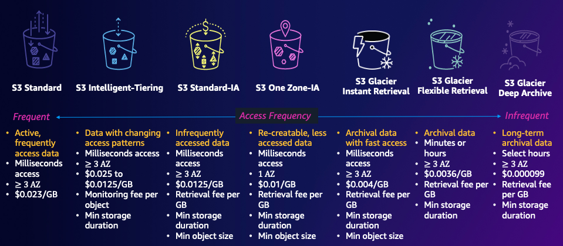

# Armazenamento (S3) e website estático

## S3 - Simple Storage Service

É um serviço **gerenciado** de **armazenamento** e recuperação de objetos, respondendo com **escalabilidade, disponibilidade e segurança e performance**

### Benefícios

- É um serviço **CORE** da AWS
- Armazenamento virtual ilimitado
- Compartilhar arquivos ou criar um website estático
- Armazenar snapshots (backup de um momento específico do armazenamento), backups, gerar um armazenamento híbrido entre ambiente on-premises (data center físico)
- Repositório de data lakes e análise de big data
- Baixa latência e alta velocidade
- Durabilidade (SLA) 99,999999999

- Buckets = Armazenamento
  - Um bucket é regional
- Objetos = Arquivos
  - Tamanho máximo de 5 TB
  - Se o Upload > 5 GB usa-se o multi-part upload
  - Usas Metadados (`chave: valor` por sistema e usuário)
  - Tags (`chave: valor` por usuário)
  - **Versionamento** de objetos
- Prefixos = Pastas Sub-pastas (árvore de objetos)
  - Exemplo: `website/app/src`

Exemplo de URL de acessso ao bucket:

`http://id-global.s3-website-sa-east-1.amazonaws.com/pasta/arquivo.txt`

No qual, é composto de:

- `http://` (não muda) o método http get padrão
- `id-global` o ID global do bucket
- `.s3-website` (não muda) (serviço)
- `-sa-east-1` região
- `.amazonaws.com` domínio
- `./pasta` prefixo (pastas)
- `/arquivo.txt` objeto

### Classes de Armazenamento

São **categorias de armazenamento**,

Com a **política de ciclo de vida** (definição da frequência do acesso ao objeto, se é frequente ou mensalmente, ou trimestralmente), os dados são migrados automaticamente entre essas categorias, refletindo em um **menor custo de armazenamento**.

