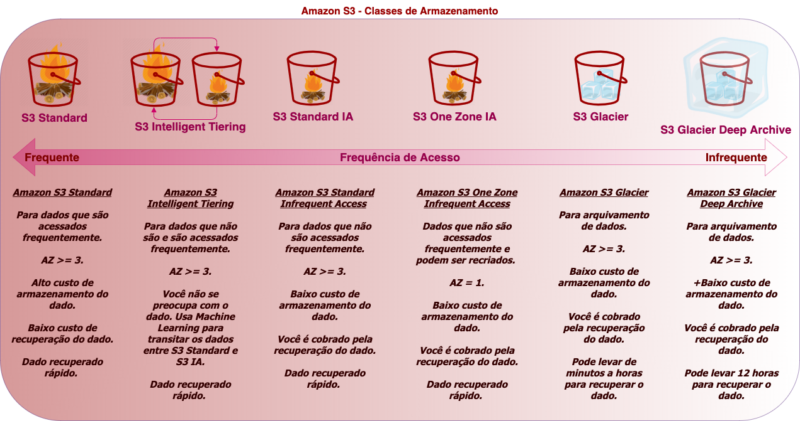

# Armazenamento (S3) e website estático

## S3 - Simple Storage Service

> É um serviço **gerenciado** de **armazenamento e recuperação de objetos**, respondendo com **escalabilidade, disponibilidade e segurança e performance**

### Benefícios

- É um serviço `CORE` da AWS, há vários uma gama de variedade para a utilização de buckets S3
  - Repositório de **data lakes** e análise de **big data**
  - Dados de sensores IoT
  - Arquivos de log
  - Dados de Treinamento de ML
  - Arquivos de mídia
  - Conteúdo gerado pelo usuário, etc
- **Armazenamento virtualmente ilimitado**
- Compartilhar arquivos ou criar um website estático
- **Armazenar snapshots** (backup de um momento específico do armazenamento), backups, gerar um armazenamento híbrido entre ambiente on-premises (data center físico)
- Baixa latência e alta velocidade
- Durabilidade (SLA) 99,999999999

- Buckets = Armazenamento
  - Um bucket é regional
- Objetos = Arquivos
  - Tamanho máximo de 5 TB
  - Se o Upload > 5 GB usa-se o multi-part upload
  - Usas Metadados (`chave: valor` por sistema e usuário)
  - Tags (`chave: valor` por usuário)
  - **Versionamento** de objetos
- Prefixos = Pastas Sub-pastas (árvore de objetos)
  - Exemplo: `website/app/src`

Exemplo de URL de acessso ao bucket:

`http://id-global.s3-website-sa-east-1.amazonaws.com/pasta/curriculo.pdf`

No qual, é composto de:

- `http://` (não muda) o método http get padrão
- `id-global` o ID global do bucket
- `.s3-website` (não muda) (serviço)
- `-sa-east-1` região
- `.amazonaws.com` domínio
- `./pasta` prefixo (pastas)
- `/curriculo.pdf` objeto

### Classes de Armazenamento

> O Amazon S3 oferece uma variedade de **categorias de armazenamento**, para atender diferentes casos de usos. Definindo uma **política de ciclo de vida**, os dados são **migrados automaticamente** entre essas categorias, refletindo em um **menor custo de armazenamento**

Para ver a respeito de ciclo de vida de objetos, [acesse esse material](./extra/storage.md)

## Bibliografia

<https://blog.dsbrigade.com/introducao-aws-s3/>

[Website de Gerador de política AWS](https://awspolicygen.s3.amazonaws.com/policygen.html), com ele é possível gerar políticas de acesso à um bucket S3
