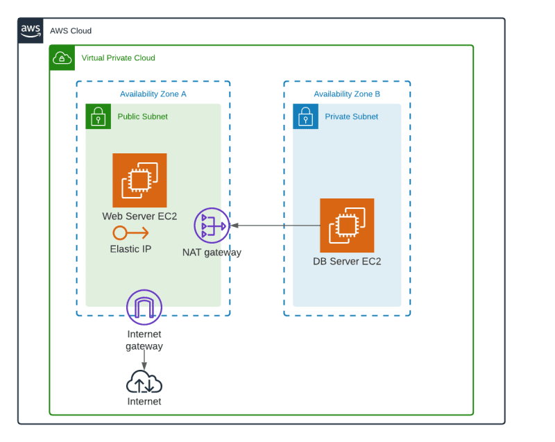

<h1>EBS, Snow Family, Glacier, VPC, DNS e Route 53</h1>

<h2>Sumário</h2>

- [Amazon EBS Elastic Block Store](#amazon-ebs-elastic-block-store)
- [Família AWS Snow](#família-aws-snow)
- [S3 Glacier \& S3 Glacier Deep Archive](#s3-glacier--s3-glacier-deep-archive)
- [Amazon VPC](#amazon-vpc)
  - [Composição](#composição)
- [AWS Route 53](#aws-route-53)
  - [Características](#características)
  - [Políticas de Roteamento](#políticas-de-roteamento)

## Amazon EBS Elastic Block Store

É um serviço de **Armazenamento de blocos** (dados) **persistentes** em alta escala fácil, projetado como um **volume** e utilizado como um disco para as instâncias Amazon EC2

- Recomendado para SOs e BDs
- Proteção por redundância (replicação entre zonas - SLA)
- Diferente tipo (SSD ou Hd)
- Redimensionar em minutos (**on-the-fly**)
- Pago conforme a provisão
- Snapshot manual ou automático (**point-in-time**) - armazena fotos de tempo em tempo   
- Criptografia em repouso (ver depois e pesquisa sobre criptografia em trânsito)
- Uma zona de disponibilidade

## Família AWS Snow

É um serviço físico para lugares no qual a rede de internet é precária ou não há infraestrutura

- Snowcone
  - Portátil
  - **Lugares inóspitos**
  - 8 TB
- Snowball
  - Há o Snowball Edge otimizado para **armazenamento** (210 TB ou 80 TB) ou para **computação** (42 TB)
  - **Migrar dados em Petabytes**
- SnowMobile
  - Caminhão de armazenamento de 100 PB
  - Região e atendimento limitada
  - Armazenamento local e durável
  - **Migrar Exabytes**

## S3 Glacier & S3 Glacier Deep Archive

- São Classes de armazenamento de objetos de **longo prazo**, seguras e **resilientes** do Amazon S3 a partir de 1USD por terabyte por mês
- Você pode configurar uma regra de ciclo de vida que envia de um bucket S3 Standard para um S3 Glacier
- Só pode ser manipulado através do AWS CLI ou AWS Tools e SDKs
- Conteúdo imutável após envio
- 1 byte até 40 terabyte
- **Glacier Instance Retrieval** 0,004 USD por GB/mês na região NV
- **Glacier Flexible Retrieval** 0,0036 USD por GB/mês na região NV
- **Glacier Deep Archive** 0,00099 USD por GB/mês na região NV
- SLA de 99,99%
- Durabilidade anual média de 99,99999999%
- Recuperação
  - Dados recuperados ficam no bucket S3 por 24 horas
  - Padrão: 3 a 5 horas
  - Massa: 5 a 12 horas
  - Expressa (< 250mb): 1 a 5 minutos

## Amazon VPC

É uma sessão isolada logicamente na AWS cloud, que permite customizar uma rede virtual e **executar recursos**, em um ambiente com controle total

- Mesmo conceito on-premises
- Total controle na configuração
- Camadas de segurança (SG - security group - & NACLs)
- Conectividade com outros serviços

### Composição

- Região (uma VPC só compõe 1 região) e Zonas Disponibilidade
- Sub-redes (Pública e Privada)
- Tabela de Roteamento
- Internet Gateway (sub-rede pública)
- Nat Gateway (sub-rede privada) (para decorar: nat de nativo, serviço para serviço)
- Security Group (SG) e Network Access List (NACLs)

## AWS Route 53

- É um serviço que atua sendo DNS (Domain Name System) que encaminha as requests (solicitações) dos usuários para os aplicativos do AWS
- O nome é referência a porta 53 (de DNS)
  - DNS é um conjuntos de regras que ajudam o cliente a chegar ao destino através de uma *friendly* URl

### Características

- Gerenciamento de DNS
- Gerenciamento de Tráfego
- Monitoramento de Disponibilidade (usando health check)
- Registro de Domínios

### Políticas de Roteamento

Definem como o Route 53 responde a consulta de DNS. Oferece as seguintes políticas:

- **Simple Routing Policy**: encaminhar trafégo para um único recurso
- **Failover Routing Policy**: Redirecionar quando há failover, para redirecionar para os servidores íntegros (healthy)
- **Geolocation Routing Policy**: Encaminhar tráfego da internet para seus recursos com base na localização dos usuários
- **Geoproximity Routing Policy**: Encaminhar tráfego com base no local dos recursos
- **Latency Routing Policy**: Encaminhar o tráfego para o recurso com a melhor latência
- **IP-based Routing Policy**: Para rotear o tráfego com base no local dos usuários e tiver os IPs de origem do tráfego
- **Multivalue Answer Routing Policy**: responder a consultas e DNS com até oito critérios selecionados
- **Weighted Routing Policy**: Encaminhar o tráfego para vários recursos nas proporções que você define
