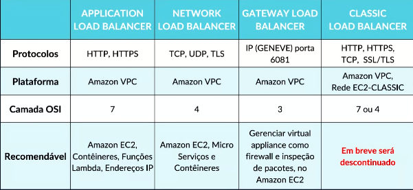

<h1> CloudFront, Elastic Load Balancer, CloudWatch </h1>

<h2> Sumário </h2>

- [CloudFront](#cloudfront)
  - [Segurança](#segurança)
- [Elastic Load Balancer](#elastic-load-balancer)
- [CloudWatch](#cloudwatch)
  - [Coletar](#coletar)
  - [Monitorar](#monitorar)
  - [Atuar](#atuar)
  - [Analisar](#analisar)

## CloudFront

> É um serviço de **entrega e conteúdo** (CDN) que entrega dados, vídeos, aplicativos e APIs a clientes e forma mundial, com **segurança, baixa latência** e alta velocidade.

Utiliza-se PoPs que são pontos de presença (**Points of presence**) para acelerar a distribuição do conteúdo estático e dinâmico da web, como arquivos `.html`, `.css`, `.js` e arquivos de imagens através da rede global de datacenters. Operando do seguinte modo:

- O usuário pede a solicitação através de uma URL
- O DNS roteia a solicitação para o POP (**locais de borda e caches de borda regionais**) mais próximo do usuário
- O CloudFront retorna a requisição enviando para o ponto de presença solicitado (funcionando como uma memória cache)

### Segurança

Para ser utilizado com segurança, utiliza-se junto a outros recursos como o **AWS WAF (Web Application Firewall)**, **Amazon Route 53**, **AWS Shield (contra DDoS)** e **AWS Certificate Manager** que cria um certificado SSL customizado para entregar o conteúdo com criptografia SSL/TSL e HTTPS

## Elastic Load Balancer

>É um serviço que distribui automaticamente o **tráfego de entrada** de aplicativos, como instâncias do EC2, contêineres, IPs address e funções Lambda

Há 3 tipos de load balancer principais

- Application Load Balancer
- Network Load Balancer
- Gateway Loada Balancer
- (descontinuado) Classic Load Balancer

---

<small>

- O ELB é **altamente disponível**. Deve-se garantir apenas que o balanceador seja implementado em várias AZs.
- O ELB é **dimensionado automaticamente** para atender à demanda do tráfego de entrada. Ele lida com o tráfego de entrada e o envia para a aplicação de back-end

O serviço **Elastic Load Balancer** é composto por 3 componentes principais:

- `Listeners`: O cliente se conecta ao listener (ouvidor), que deve ser fornecido uma porta e o protocolo
- `Grupos de Destino (Target groups)`:  São os servidores de back-end (servidores), podendo ser instâncias EC2, funções do AWS Lambda, ou endereços IP.
  - Deve-se também definir uma verificação de integridade (health check) para cada Target group
- `Regras`: são condições que pode ser o endereço IP de origem do cliente, e uma condição para qual Target Group deve-se enviar o tráfego

</small>

Veja mais sobre o funcionamento do [Application Load Balancer](./extra/application-load-balancer.md).

## CloudWatch

> É uma ferramenta de **monitoramento de desempenho dos recursos** e dos aplicativos que voce executa no seu ambiente

Funciona em quatro etapas: `Coletar` ➡ `Monitorar` ➡ `Atuar` ➡ `Analisar`

Veja as vantagens do [Monitoramento de recursos na AWS](./extra/monitoring.md).

### Coletar

- Coletar por meios de métricas e logs de recursos e serviços
- Recursos e serviços na Nuvem e on-premises
- Métrica padrão 5 minutos / detalhada ($$$) por minuto
- Exemplo de métricas:
  - **EC2:** Utilização CPU, Status check, Rede (**Não verifica memória RAM**)
  - **EBS:** Leitura e Gravação do disco
  - **S3:** tamanho do bucket, número de objetos
  - **Lambda:** tempo de execução e duração

### Monitorar

- **Visualizar** as aplicações e sua infraestrutura em um único local
- Acessar um dashboard automático ou personalizado, com os serviços e métricas customizadas
- Configurar alarmes visuais do ambiente

### Atuar

- **Criar alarmes** para atuar como **gatilho**, baseado nas métricas de uso e desempenho
- É possível criar um alarme que envia uma notificação quando um limite (threshold) de faturamento (billing alerts) é excedido
- Opções do gatilho: amostra, %, valor máximo, mínimo etc
- Alarm Action
  - **Auto Scaling Group:** Aumentar ou diminuir o número de instâncias no Amazon EC2
  - **Amazon EC2:** Parar, terminar, reiniciar ou recuperar uma instância
  - **Amazon SNS:** Enviar **notificações** para um **SNS Topic**, para que os assinantes recebam um **e-mail**

### Analisar

Analisar em tempo real o ambiente, em segundos ou posterior com até 15 meses de armazenamento dos logs

Você pode atribuir os seguintes **estados de alarmes:**

- `OK`: **tudo está ocorrendo normalmente**, a métrica está dentro do **threshold** (limite) definido.
- `ALARM`: algo ruim aconteceu ou **indicar** que o **threshold** da métrica foi atingido.
- `INSUFICIENT_DATA`: o alarme está inicializando, ainda está coletando dados ou a métrica não está disponível
