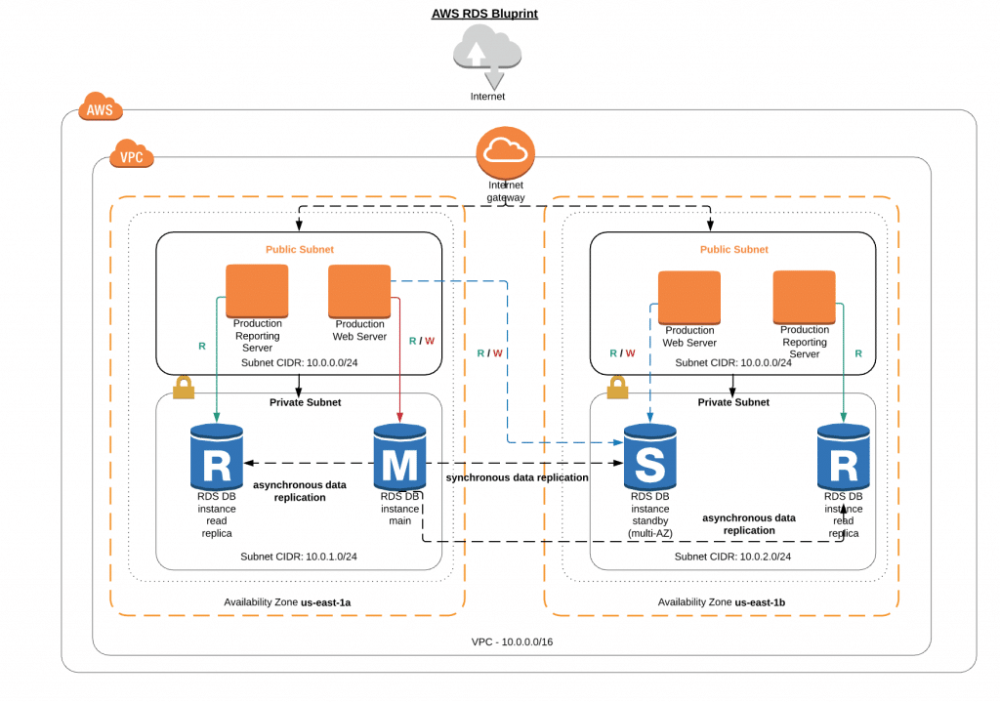

# Banco de Dados SQL, NoSQL e nuvem como código

## Amazon RDS - Relational Database Service


> O Amazon Relational Database Service (**Amazon RDS**) é um banco de dados relacional que se destaca  por sua **escalabilidade**, **automatização** na aplicação de patches, provisionamento de hardware e backup na Nuvem AWS

**Mecanismos disponíveis**: Amazon Aurora, MySQL, MariaDB, PostgreSQL, Oracle, SQL Server

- Simples, seguro e funcional
- Réplica em outra zona e Redundância de dados
- Eliminar Congelamento e Minimizar picos
- Alta disponibilidade

### Arquitetura



O Recurso (banco de dados) do RDS é replicado entre duas ou mais zonas de disponibilidade (multi-az) para ter uma maior disponibilidade, tendo uma instância de BD primária e as que estão em outras zonas,  sendo réplicas do primário

## Amazon DynamoDB - Para Banco de Dados Não Relacional


> É um banco de dados não relacional, **NoSQL** de **chave-valor** e documento que oferece desempenho de milissegundos

- Serverless (sem servidor com a AWS gerenciando)
- Escalável (virtualmente ilimitado)
- Confiável (criptografia em repouso por padrão)
- Rápido (latência em microssegundos)

- Tabela é uma **coleção de itens**
  - Cada item possui **pelo menos um atributo** e não pode ultrapassar 400kb
- Chave primária e **obrigatória**, utilizado para identificar um item na Tabela
- Chave secundária é **opcional** e fornece flexibilidade na consulta

## AWS CloudFormation


> É um serviço que oferece uma **linguagem comum** para que você **possa descrever e fornecer todos os recursos de infraestrutura** em um ambiente de Nuvem

- É Semelhante ao Terraform
- Infraestrutura utilizando documento `json` ou `yaml` ou um `template` já predefinido pela AWS

- **Replicar** uma infraestrutura múltiplas vezes
- Time de desenvolvedores usa como **ambiente de testes e produção**
- Infraestrutura como Código - **IaaC**
- Cria upload dos Templates para replicar múltiplas vezes a mesma arquitetura para ter automatização e rastreabilidade
- Criar ou excluir `Stacks` (pilhas) - **arquitetura em várias camadas** - São templates dentro das camadas de organização (VPC, Regiões, SubRedes etc)
- Quando se precisa de **controle de versão**

```yaml
---
# Template EDN versao 09/03/2023
# Utilizar regiao Norte da Virginia

AWSTemplateFormatVersion: "2010-09-09"
Resources:
  EC2Instance:
    Type: "AWS::EC2::Instance"
    Properties:
      ImageId: "ami-006dcf34c09e50022"
      InstanceType: "t2.micro"
      UserData:
        Fn::Base64: !Sub |
          #!/bin/bash
          yum install -y httpd
          systemctl start httpd
          systemctl enable httpd
          echo "Hello World, estou vivo!" > /var/www/html/index.html
      SecurityGroupIds:
        - !Ref InstanceSecurityGroup
      SecurityGroups:
        - Ref: "InstanceSecurityGroup"
      AvailabilityZone: "us-east-1a"
  InstanceSecurityGroup:
    Type: "AWS::EC2::SecurityGroup"
    Properties:
      GroupDescription: "Enable SSH and HTTP access"
      SecurityGroupIngress:
        - IpProtocol: tcp
          FromPort: 22
          ToPort: 22
          CidrIp: "0.0.0.0/0"
        - IpProtocol: tcp
          FromPort: 80
          ToPort: 80
          CidrIp: "0.0.0.0/0"
Outputs:
  WebsiteURL:
    Description: Sua carga de trabalho
    Value: !Join
      - ''
      - - 'http://'
        - !GetAtt
          - EC2Instance
          - PublicDnsName
```
