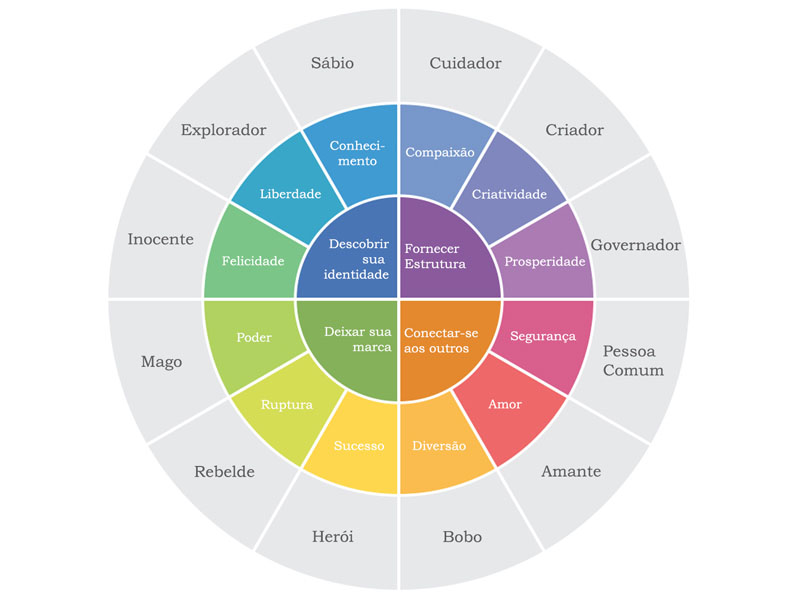
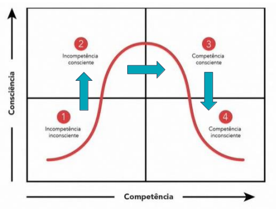

<h1> Como alavancar a sua carreira - Aulas </h1>

<h2> Sumário </h2>

- [🎈 Aula de Networking](#-aula-de-networking)
- [Imagem e Marca Pessoal](#imagem-e-marca-pessoal)
  - [Ferramentas](#ferramentas)
    - [Os 4 estágios da competência](#os-4-estágios-da-competência)
  - [Marca Pessoal](#marca-pessoal)
- [Perfil Comportamental (DISC)](#perfil-comportamental-disc)
- [Currículo](#currículo)
- [Entrevista](#entrevista)
  - [Storytelling](#storytelling)
  - [Como se preparar para a entrevista](#como-se-preparar-para-a-entrevista)
  - [Como usar oss métodos CHA/CAR para as perguntas](#como-usar-oss-métodos-chacar-para-as-perguntas)
- [LinkedIn](#linkedin)
  - [Estratégias para o networking profissional](#estratégias-para-o-networking-profissional)
  - [Ferramentas de apoio ao Networking](#ferramentas-de-apoio-ao-networking)
- [Site de Vagas e Processo Seletivo](#site-de-vagas-e-processo-seletivo)

## 🎈 Aula de Networking

> Quem não é visto, não é lembrado.

- É a forma e **cultivar relações tanto profissionais quanto pessoais** em diversos ambientes.
- Uma rede de interessados e não de interesse, é algo bilateral. É a troca de informações, conhecimentos, indicações e **gerar oportunidades**.
- **Ampliar** as oportunidades de sucesso profissional, não sendo uma atitude unilateral, deve ser reciproco, benefício deve ser mútuo.
- Quanto mais a gente sabe, mais a gente deve compartilhar e não reter o conhecimento para si próprio apenas.
- Ter uma rede de contatos é importante para nos sermos lembrado

> Não se fechar no próprio casulo

[Vídeo sobre Dicas de Networking](https://www.youtube.com/watch?v=IIRplTvwZwc&pp=ygUcZGljYXMgZGUgbmV0d29ya2luZyBwcmV2aXN1bA%3D%3D&ab_channel=PrevisulSeguradora)

## Imagem e Marca Pessoal

Passamos uma imagem da gente o tempo todo de forma inconsciente, ter noção disso pode nos ajudar a potencializar a mensagem que queremos passar.

### Ferramentas

A imagem (de forma geral) é passada através de: **Cores** (Psicologia das cores), **Arquétipos** (Como a psicologia auxilia na imagem pessoal, exemplo: arquétipos de jung), Outros elementos.

Link para estudo aprofundado sobre [Arquétipos de Jung ↗](https://vestindoautoestima.com.br/os-12-arquetipos-de-jung-e-o-estilo-pessoal/)

#### Os 4 estágios da competência

Para se ter noção da imagem que passamos podemos observar da seguinte forma sendo analisando na curva de aprendizagem de **competências**

### Marca Pessoal

A marca pessoal está também atrelada ao comportamento e postura

Postura profissional é o conjunto de: Escolhas, Ações, Comportamentos e Atitudes realizadas no dia a dia

> Postura profissional e comportamento podem pesar mais que desempenho
>
> Rosana Fa Gonçalves

## Perfil Comportamental (DISC)

É uma espécie de mapeamento que identifica forças e pontos de desenvolvimento em cada pessoa. É uma ótima ferramenta para iniciar ou se aprofundar no **autoconhecimento**.

DISC é uma ferramenta que auxilia a medir os pontos a desenvolver e fortes de cada um. É uma ferramenta que lista 4 tipos de **perfis diferentes:**

- **Dominância**
- **Influência**
- **eStabilidade**
- **Conformidade**

Exemplo de teste: [PactoRH](https://www.pactorh.com.br/teste-disc/disc/faca-agora-teste-disc/)

## Currículo

O currículo tem o objetivo de agrupar as capacidades técnicas do perfil profissional, permitindo os recrutadores fazerem uma pré-seleção a partir dessas informações. Ele é um **Marketing Pessoal**.

Criar um currículo estratégico é importante para os recrutadores saberem qual área você pretende atuar, e quais conhecimentos você possui de forma clara e honesta.

## Entrevista

É necessário se ter um auto conhecimento para saber poder relatar a própria trajetória, buscando falar o que mais atende à vaga desejada.

Relata sobre você não abordando muito a parte profissional

### Storytelling

É a arte de contar a própria história, para transmitir uma **mensagem**, trazendo o **protagonismo** para si. Não sendo prolixo (não respondendo a parte importante da pergunta que o recrutador pede). Trazendo fatores que sejam importantes para o momento

- Se existe uma vaga aberta, existe um problema. O recrutador verifica se você vai resolver o problema necessitado
- Quais foram as suas maiores conquistas pessoais
- Construir uma narrativa/história relevante e coesa (que faça sentido e que tenha um começo meio e fim)
- Fazer uma linha do tempo

### Como se preparar para a entrevista

- Se apropriar do conteúdo do seu Currículo (trazer credibilidade na sua fala)
- Ter **autoconfiança** (saber qual a ferramenta que o recrutador pede e correlacionar com as suas próprias habilidades)
- Descobrir sobre a empresa (quais as influências que a empresa tem na rede social, e quais são os valores da empresa)

### Como usar oss métodos CHA/CAR para as perguntas

- Ter em mente as **principais competências (CHA - Conhecimento, Habilidade Atitude)**
- Responda as perguntas **COMO**, com base no **CAR (Contexto, Ação e Resultado)**

## LinkedIn

Possibilita conhecer profissionais que entendam o que você está vivenciando, e te auxiliar em uma possível movimentação no mercado.

### Estratégias para o networking profissional

- Criar conexões com recruiters e pessoas da mesma área que a sua para troca de experiências
- Comentar nas publicação de outros profissionais conteúdos que agreguem valor
- Ser ativo na plataforma, compartilhando e interagindo sobre conteúdo relevante

### Ferramentas de apoio ao Networking

[snappr - Ferramenta que analisa foto de perfil do LinkedIn)](https://www.snappr.com/photo-analyzer)
[Site que oferece insights de índice de Social Selling do LinkedIn](https://www.linkedin.com/sales/ssi)

## Site de Vagas e Processo Seletivo

- Recomenda-se ter no mínimo de 70% de aderência para a vaga
- Antes de ir para o processo seletivo, estude antes:
  - A vaga antes da entrevista **"A preparação supera o talento"**
  - O modelo da empresa (fit cultural, quem fundou, como eles trabalhem, conhecer os fornecedores, saber a empresa)
  - Estudar como se apresentar para a divulgação profissional
  - Estudar como se apresentar, por exemplo: se você não tem experiência, saber como divulgar os projetos que você fez, ou saber como divulgar o próprio interesse para aprender tecnologias
- **Se há uma vaga**, há uma problema que essa vaga deve soluionar para a empresa
