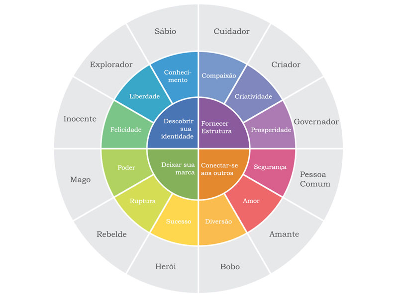

# Imagem e Marca Pessoal

Passamos uma imagem da gente o tempo todo de forma inconsciente, ter noção disso pode nos ajudar a potencializar a mensagem que queremos passar.

## Ferramentas

A imagem (de forma geral) é passada através de: **Cores** (Psicologia das cores), **Arquétipos** (Como a psicologia auxilia na imagem pessoal, exemplo: arquétipos de jung), Outros elementos.

Link para estudo aprofundado sobre [Arquétipos de Jung ↗](https://vestindoautoestima.com.br/os-12-arquetipos-de-jung-e-o-estilo-pessoal/)

### Os 4 estágios da competência

Para se ter noção da imagem que passamos podemos observar da seguinte forma sendo analisando na curva de aprendizagem de **competências**

## Marca Pessoal

A marca pessoal está também atrelada ao comportamento e postura

Postura profissional é o conjunto de: Escolhas, Ações, Comportamentos e Atitudes realizadas no dia a dia

> Postura profissional e comportamento podem pesar mais que desempenho
>  
 Rosana Fa Gonçalves 

