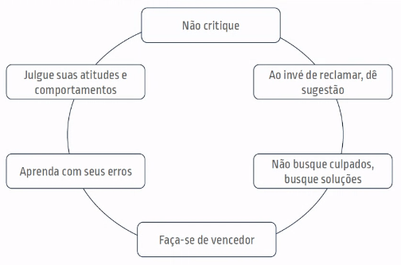

# Ser Protagonista da própria carreira

## Locus de Controle

É usado para se referir à percepção que uma pessoa tem sobre as causas do que acontece na sua vida: ou seja, em que medida ela é considerada responsável pela origem do comportamento? Ela é externa ou interna?

## Locus Externo

Acreditam que os acontecimentos da vida não estão dentro de seu controle, mas nas mãos de alguma força externa.

- Foco no **Problema**
- Pergunta **Porquê**
- Foco no **Fracasso**

## Locus Interno

Sugere que a causa de um evento ou comportamento depende da força interna do indivíduo e que as decisões e esforços pessoais podem decidir ou influenciar o que acontecerá na vida de uma pessoa.

- Foco na **Solução**
- Pergunta **Como?**
- Foca no **Que Aprendeu**

## Protagonista

Todos temos que ser empreendedor da nossa carreira. Um líder empreendedor sabe ter ideias criativas pensando estrategicamente e conhece os liderados para ajudar na evolução de uma empresa

Existe **chefes** e **líderes**.

Sendo criativo e um bom líder, você é empreendedor

Tem que estudar para saber se comunicar bem, como abordar a ideia de forma produtiva.

Há lideres que buscam apenas evoluções numéricas (atingir a meta). E aqueles que buscam a evolução tanto dos funcionários quanto dos indivíduos (**protagonismo**)

Quando vai expor uma ideia produtiva, faça isso com prioridade (primeiro ao gestor)

### Como ser protagonista?

- **Locus Interno**: Entender onde e como está para planejar chegar onde sonha.
- **Responsabilidade**: Sua carreira depende dde você. É necessário voltar a responsabilidade do sucesso para o "eu".
- **Protagonismo**: Responsável pela carreira e pelo sucesso.

#### Aceita-te, conheça-te, supera-te

Auto conhecimento sobre si para se superar para chegar onde deseja

"Eu não vivo no passado, o passado vive em mim"

### Auto Responsabilidade

- Visão **otimista, motivação** e **produtividade**
- Foca na **solução** ao invés do problema
- Busca **aprender** com seus erros e falhas
  - "O inteligente aprende com **seus erros**; O sábio aprende com o **erro dos outros**"

#### 6 leis da auto responsabilidade

Saber como andar na frente para saber ser vencedor, mesmo que vá errar na frente
