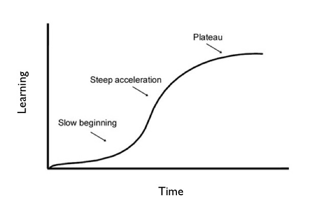

# Síndrome do Impostor e Inteligência Emocional

## Síndrome do Impostor

É o nome dado quando indivíduos completamente capacitados se enxergam como não suficientes ou não merecedoras de suas conquistas.

As pessoas que sofrem disso mostram incapazes de apreciar os próprios feitos na vidas. Isso vem acompanhado de sentimentos de inferioridade, insegurança e medo. Sentem medo de ser "desmascarado", ser uma fraude sempre prestes a ser descoberta.

### Sintomas de não pertencimento

- **Perfeccionismo**: "Não está bom"
- **Procrastinação**: "Amanhã eu termino"
- **Multitarefas**: "Fazendo tudo ao mesmo tempo"
- **Ser Forte**: "Não precisa descansar"
- **Autocrítica extrema**: "O que irão pensar disso"
- **Preguiça**: "Querer o jeito mais fácil"

### Como lidar com esse fenômeno

- Ter em mente que suas conquistas não são pura sorte. **Pequenas conquistas ainda ão conquistas**.
- Aprender a **valorizar suas capacidades pessoais**
- Confiar no seu potencial
- Autoconhecimento
  - Por exemplo: ter um sonho, um sonho já demonstra autoconhecimento pois mostra onde você quer chegar

Vivemos em uma sociedade em que as pessoas limitam os outros, se você aceitar o elogio, você é entendido como "metido", você tem que ser mais "humilde". Por exemplo: algo que pode ser observado é que elogios raramente receberão um "obrigado" de volta

### Como controlar o Fenômeno do Impostor

- **Compartilhar as angústias** com alguma outra pessoa de **confiança**
- Conhecer que todos temos **defeitos e qualidades**
- Erros e fracassos acontecem, eles podem ser aproveitados para o desenvolvimento pessoal
  - O que que poderia ser feito de diferente?
  - O que ocorreu?
  - O que pode estar levando à essa falha?
- Evitar se comparar com os outros
  - Se inspire em alguém, não se compare
  - Só podemos nos comparar com nós mesmos
  - Cada um tem a sua própria capacidade de evolução
- Respeitar as **próprias capacidades e limitações**
  - Se aceitar quem é

### Zona de Conforto X Zona de Crescimento

### Curva de aprendizagem

Essa síndrome pode ser visualizado quando vamos aprender algo novo:

> Se visualizarmos o **aprendizado** como uma curva, o seu início é íngreme, indicando uma subida rápida, enquanto o meio é uma linha paralela à base. É essa linha horizontal que o _Platô_ representa: uma zona de conforto, em que chegamos a um ponto que sentimos ser “bom o suficiente” e perdemos a motivação para avançar

[Fonte da Informação](https://blog.evolucional.com.br/plato-ok-e-o-aprendizado-saiba-como-funciona/)

### É necessário ter sempre em mente

- **O progresso não é linear**: Para ir além, é necessário correr riscos de errar, e estar aberto a aprender com o erro
- **Persistir e ter paciência**: Aceitando as próprias limitações e entendendo o próprio tempo
- **Nosso pensamento tem grande poder sobre nós**: Nosso maior inimigo é a nossa própria mente, nós colocamos os obstáculos que nos dificulta
- **Reconhecer e comemorar todas as suas conquistas**: Das as pequenas conquistas até as grandes, todas fazem parte do progresso

## Inteligência Emocional

Trata-se da capacidade de **gerenciar** relacionamentos, conhecer, expressar e estar ciente de suas emoções e sentimentos e dos que estão a sua volta, lidando com eles de forma inteligente

> Emoção ≠ Sentimento
>
> **Emoção** é reação enquanto que **Sentimento** é construção

### Emoção

É a reação imediata a um estímulo, algo que mexe com você e que não envolve pensamento.

- Passageiras
  - Também sendo uma maneira de lidar com a emoção, sabendo que ela vai passar
- Emoção bases:
  - Raiva
  - Medo
  - Alegria
  - Tristeza
  
### Sentimento

Envolve um alto grau de cognitivo, de percepção e avaliação de algo.

- Menos intensos
- Emoções bases:
  - Amor
  - Felicidade
  - Ódio
  - Decepção

### O que é Inteligência Emocional

> Maior representante dessa ideia: Daniel Goleman

É a capacidade de gerenciar relacionamentos e ter ciência das emoções e sentimentos.

- Interpretar a situação e ver as possibilidades dos eventos que ocorreram
- Todas as emoções em excesso adoecem a pessoa
- Primeira ação a tomar: **Se perceber** (está na emoção ou sentimento)

### Domínios da Inteligência Emocional

- **Autoconsciência**: Você se perceber, se você sabe como agir
- **Autocontrole**: Fazer perguntas sobre a emoção para saber como resolver
  - O que nos gera medo ou o que nos afligem? (quais são os nossos gatilhos?)
- **Automotivação**: Sendo **Auto**, o Eu, e a **Motivação** o motivo para agir, ou seja **Buscar motivo para agir**
  - Não delegar, terceirizar a Motivação. Você que precisa ter o motivo para agir
- **Empatia**: Perceber ou saber o momento (abertura) do outro para falar, saber como falar e principalmente **saber como escutar**
  - Para reflexão: por quê temos duas orelhas e uma boca
- **Sociabilidade** (Habilidades sociais): Saber lidar com as pessoas e pensamentos diferentes do seu, saber aceitar críticas que pareçam pessoais

### Maturidade Emocional

É o que torna a pessoa capaz de se comportar de forma positiva e construtiva

### Como desenvolver a Inteligência Emocional?

Passos:

> Autoanálise
>> Protagonismo
>>> Pensar no Todo
>>>> Paciência e Persistência
>>>>> Controle da Impulsividade 🏆

### Autoconhecimento

Ter um bom autoconhecimento ajuda não só, entender melhor a si mas também entender melhor a emoção dos outros

#### Na prática

- Como reagir quando contrariado?
- Ou repreendido?
- E por fim, quando for elogiado?

### Conclusão

- Empatia: **Perguntar e entender** antes de falar
- Você que é o único que pode fazer a mudança
- O **mundo é de quem faz perguntas**, quem sabe se fecha em aprender
- FAÇA PERGUNTAS 😎🎈.
