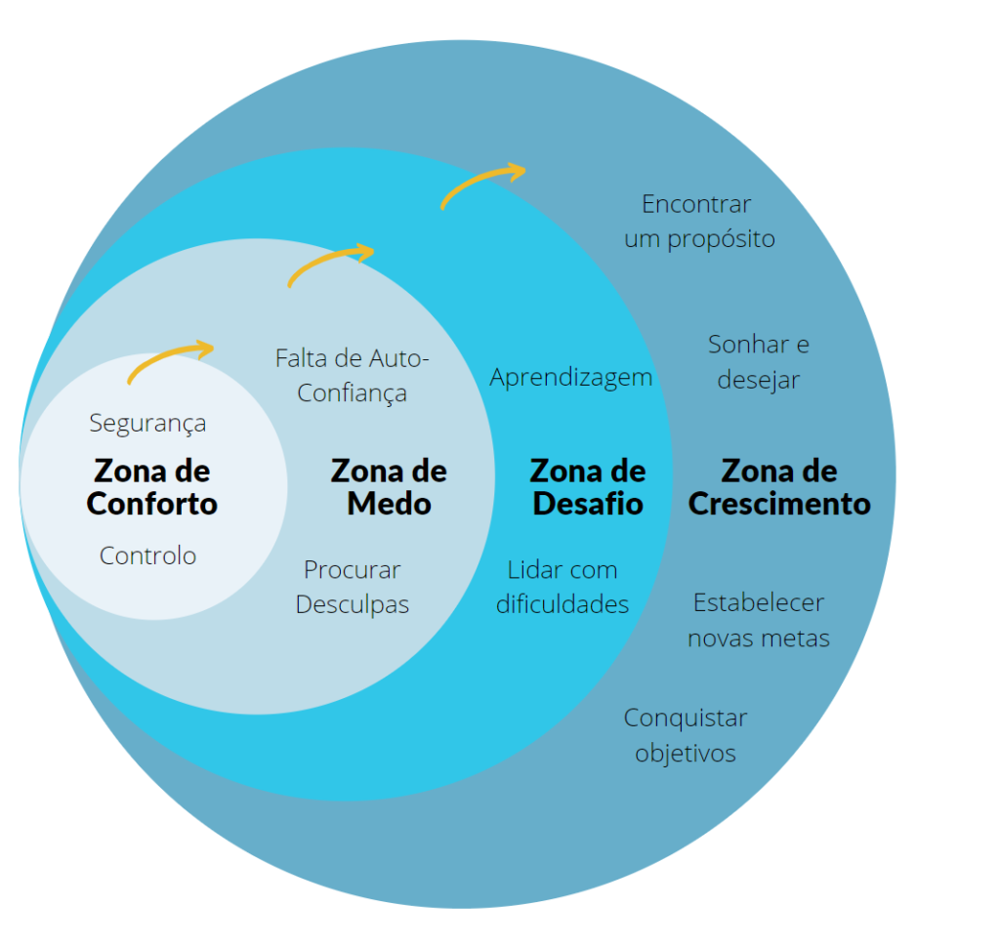
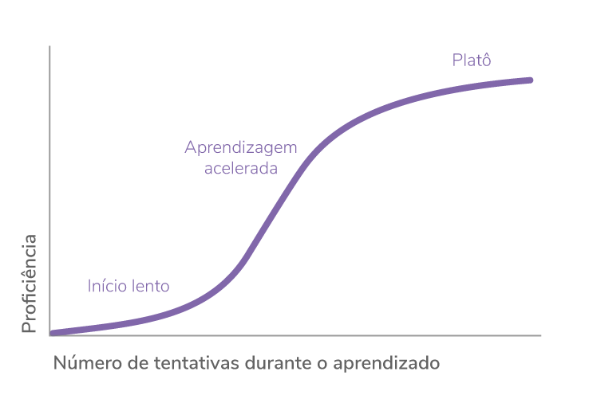

# Síndrome do Impostor e Inteligência Emocional

## Síndrome do Impostor

O medo de ser "desmascarado". Pela  insegurança na própria capacidade

Sintomas de não pertencimento:

- Perfeccionismo
- Procrastinação
- Multitarefas
- Ser Forte
- Autocrítica extrema
- Sentimento de não pertencimento

### Como lidar com esse fenômeno

- Ter em mente que suas conquistas não são pura sorte. **Pequenas conquistas ainda ão conquistas**.
- Aprender a **valorizar suas capacidades pessoais**
- Confiar no seu potencial
- Autoconhecimento
  - Ter um sonho já mostra o autoconhecimento, mostra onde você quer chegar

- Vivemos em uma sociedade em que as pessoas limitam os outros, se aceitar o elogio, você é "metido", você tem que ser "humilde".
  - Elogios raramente receberão um "obrigado" de volta

### Como controlar o Fenômeno do Impostor

- **Compartilhar as angústias** com alguma outra pessoa de **confiança**
- É necessário conhecer que todos temos **defeitos e qualidades**
  - Erros e fracassos acontecem, podem ser aproveitados para o desenvolvimento pessoal
    - O que que poderia ser feito de diferente?
    - O que ocorreu?
    - O que pode estar levando à essa falha?
- Evitar se comparar com os outros
  - Se inspire em alguém, não se compare
  - Só podermos nos comparar com nós mesmos
  - Cada um tem a sua própria capacidade de evolução
- Respeitar as **próprias capacidades e limitações**
  - Se aceitar quem é

### Zona de Conforto X Zona de Crescimento

### Ter sempre em mente

- O progresso não é linear
  - Aprender com o Erro
  - Estar aberto a aprender
- Persistir e tenha paciência
  - Aceitando as próprias limitações e entendendo o próprio tempo
- Nosso pensamento tem grande poder sobre nós
  - Nosso maior inimigo é a nossa própria mente, nós colocamos os obstáculos que nos dificulta
- Reconhecer e comemorar todas as suas conquistas
  - Das as pequenas conquistas até as grandes, todas fazem parte do progresso

### Curva de aprendizagem

## Inteligência Emocional

Emoção ≠ Sentimento

### Emoção

Reações a um estimulo/ evento externo

- Passageiras
  - É uma maneira de lidar com a emoção, sabendo que ela vai passar
- Emoção bases:
  - Raiva
  - Medo
  - Alegria
  - Tristeza
  
### Sentimento

- Envolve um alto grau de cognitivo (pensamento)
- Menos intensos
- Emoções bases:
  - Amor
  - Felicidade
  - Ódio
  - Decepção

### O que é Inteligência Emocional

Autor: Daniel Goleman

É a capacidade de gerenciar relacionamentos e ter ciência das emoções e sentimentos.

- Interpretar a situação e ver as possibilidades dos eventos que ocorreram
- Todas as emoções em excesso adoecem a pessoa
- Primeira ação a tomar: **Se perceber** (está na emoção ou sentimento)

### Domínios da Inteligência Emocional

- Autoconsciência
  - Você se perceber, se você sabe você sabe como agir
- Autocontrole
  - Fazer perguntas sobre a emoção para saber como resolver
    - O que que gera medo
    - Em que situações que gera medo
  - Pedir ajuda pra lidar com a emoção (profissional ou )
- Automotivação
  - Auto (Eu) Motivação (Motivo para agir) - Buscar motivo para agir
  - Não delegar, terceirizar a Motivação. O motivo para fazer/agir você que tem que ter
- Empatia
  - Perceber o momento (abertura) do outro para falar
  - Saber escutar
    - Para reflexão: por quê temos duas orelhas e uma boca
- Sociabilidade - Habilidades sociais
  - Lidar com as pessoas

### Maturidade Emocional

É o que torna a pessoa capaz de se comportar de forma positiva e construtiva

### Como desenvolver a IE?

Passos:

- Autoanálise
  - Protagonismo
    - Pensar no Todo
      - Paciência e Persistência
        - 🏆 Controle da Impulsividade

### Autoconhecimento

Ter um bom autoconhecimento ajuda a si entender, e entender melhor a própria emoção e a dos outros

- Na prática:
  - Como reagir quando contrariado?
  - Ou repreendido?
  - E elogiado?

### Conclusão

- Empatia: **Perguntar** antes de falar
- Você que faz a mudança
- O **mundo é de quem faz perguntas**, quem sabe se fecha em aprender
- FAÇA PERGUNTAS.
