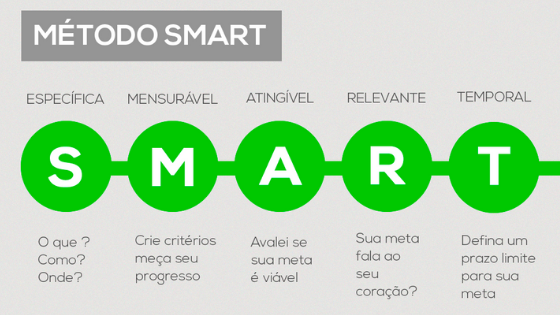

# Lifelong Learning e o Papel da Mentoria no processo de Aprendizagem

## Lifelong Learning

É a **aprendizagem ao longo da vida**, sendo um processo contínuo, que não acaba com o fim de um curso, ou uma fase em uma instituição de ensino.

O **aprendizado** em si ocorre através de:

- Experimentações
- Pesquisas
- Aprender coisas novas
- Aprender de várias formas diferentes o mesmo assunto

### Características

- **Mentalidade de Crescimento:** aprender a superar os obstáculos e vê-los como oportunidade de aprender
- **Mente Aberta:** mente aberta para aprender, desaprender, e reaprender
- **Curiosidade Intelectual:** É a própria necessidade de entender o processo daquilo que se aprende (o porquê), buscar aprender
- **Humildade Intelectual:** _aprender a **aprender**_, estar aberto a aprender com os outros, e novas formas e
- **Protagonismo na aprendizagem:** não se limitar na própria aprendizagem e em perguntar

**Vantagens:**

- Desenvolvimento de novas habilidades;
- Estímulo da Criatividade;
- Domínio de novas tecnologias;
- Surgimento de oportunidades.

### Plano de ação e definição de metas

É preciso traçar planos e metas, nunca fique parado, sempre busque aprender de novo

### Diferença entre metas e objetivos

|       **Meta**      |      **Objetivo**     |
|:-------------------:|:---------------------:|
| Específico          | Abrangente            |
| Resultado em etapas | Resultado final      |
| Curto prazo         | Longo prazo           |
| Fácil de se avaliar | Difícil de se avaliar |
| Quantitativo        | Qualitativo           |

### SMART

O método de plano de ação SMART foca em definir características para uma meta, definindo o que ela precisa ser de fato. Ou seja **definir metas e objetivos de maneira inteligente**.

- Specific / Específico
- Measurable / Mensurável
- Action oriented / Orientado para uma ação
- Realistic / Realista
- Time-bounded / Tempo determinado

Sendo necessário definir ao longo do processo de aprendizagem:

- **Ação:** Decidir o que precisa aprender
- **Meta:** Etapas de aprendizagem
- **Métrica:** Saber medir o seu aprendizado (realizando provas, questionamentos, testes etc)
- **Prazo:** Definir um prazo para não se perder durante o aprendizado
- **Avaliação:** Saber se vale a pena aprender aquilo

Separar o momento certo para buscar aprender, não aprender várias coisas ao mesmo tempo

> O analfabeto do século XXI não será aquele que não consegue ler e escrever, mas aquele que não consegue **aprender** **desaprender**, e **reaprender**.
>
> 
Alvin Toffler

## Mentoria e papel do mentorado

Ambos tem o objetivo de desenvolver o mentorado

- **Mentor:** aquele que tem experiência em uma determinada área, com **vasta experiência**
- **Mentorado:** aquele que deseja **verdadeiramente** aprender com a experiÊncia do mentor e **se fortalecer pessoal e profissionalmente**

Pra ser um **Mentorado:**

- Ser sempre o **protagonista** da própria carreira
- Questione, faça perguntas alinhadas à sua meta
- Evite respostas simplificadas, busque aprofundar o conhecimento
- Se comprometer no aprendizado
- Ter foco e **presença plena**

### Como otimizar a mentoria

Palavras chaves:

- O que você recomenda?
- Como posso melhorar meu desempenho?
- Qual sua ideia sobre esse assunto?
- Quais ações funcionaram para você no passado?
- **Saiba ouvir uma crítica com sabedoria**
- **Execute e coloque em prática no tempo combinado**
