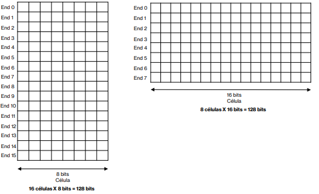
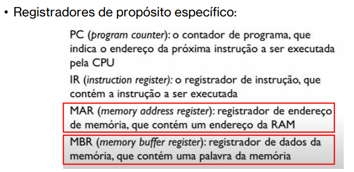
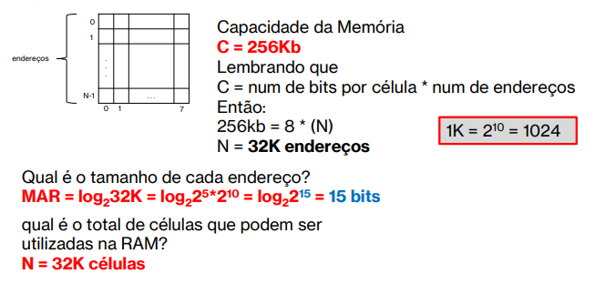
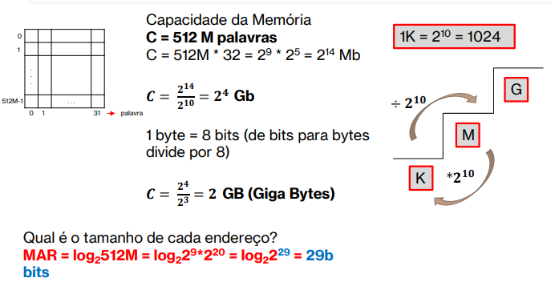
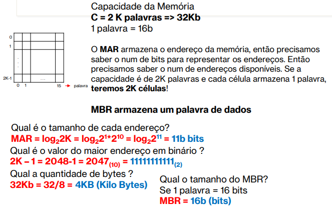

<h1>Estudo sobre sistema operacional</h1>

<h2>Sumário</h2>

- [Tipos de Sistemas Operacionais](#tipos-de-sistemas-operacionais)
  - [Sistemas Mono-tarefas](#sistemas-mono-tarefas)
  - [Sistemas Multi-tarefas](#sistemas-multi-tarefas)
  - [Sistemas com múltiplo processadores](#sistemas-com-múltiplo-processadores)
- [CPU (Unidade Central de Processamento)](#cpu-unidade-central-de-processamento)
  - [Unidade lógica e aritmética (ULA)](#unidade-lógica-e-aritmética-ula)
  - [Unidade de Controle (UC)](#unidade-de-controle-uc)
- [Registradores](#registradores)
  - [Contador de instruções](#contador-de-instruções)
  - [Apontador de Pilha](#apontador-de-pilha)
  - [Registrador de Estado](#registrador-de-estado)
- [Memória Cache](#memória-cache)
- [Memória Principal](#memória-principal)
  - [ROM (Read Only Memory)](#rom-read-only-memory)
  - [Composição da Memória Principal](#composição-da-memória-principal)
- [Memória secundária](#memória-secundária)
- [Barramento](#barramento)
  - [Pipelining](#pipelining)
- [Endereçamento e Capacidade de Memória Principal](#endereçamento-e-capacidade-de-memória-principal)
  - [Exercício 1](#exercício-1)
  - [Exercício 2](#exercício-2)
  - [Exercício 3](#exercício-3)
  - [Exercício 4](#exercício-4)

## Tipos de Sistemas Operacionais

Os tipos de SOs estão relacionados com a evolução do hardware e das aplicações que eles suportam

Podem ser classificados em

### Sistemas Mono-tarefas

É Relacionados com o surgimento dos primeiros computadores na **década de 60**

Só executam um programa por vez, ou seja, para um usuário usar outro programa, terá que esperar o programa corrente finalizar

Todos os recursos do hardware ficam exclusivos à um único programa. Enquanto um programa aguarda a digitação de um caractere do teclado, o processador ficava ocioso

### Sistemas Multi-tarefas

Os recursos do computador são compartilhado entre seus usuários e aplicações

Compartilhamento de tempo no processador distribuído

Um **processo** ocupa o **processador** enquanto os outros ficam em fila aguardando a sua vez de executar.

O sistema operacional (junto ao escalonador) decide a forma de gerenciar o acesso concorrente aos recursos do computador

**Vantagens**: melhor utilização dos recursos disponíveis, o que resulta em menor tempo de resposta das aplicações. Pois o compartilhamento dos recursos é distribuído entre as aplicações e dá o aumento da produção do usuário

### Sistemas com múltiplo processadores

O SO distribui as tarefas entre 2 ou + processadores

**Vantagem:** permite que mais de um programa possa ser executado simultaneamente OU o mesmo programa seja dividido em várias partes (threads) e executado simultaneamente nos vários processadores, aumentando o seu desempenho

Sistemas com múltiplos processadores possui 2 ou + CPU's interligadas e trabalhando de forma conjunta em resolver um problema

Ideal para aplicações que precisam de grande poder computacional

Podem ser divididos em, em função da comunicação entre CPU's e a forma que compartilhamento a memória:

**fortemente acoplados**: uma única memória principal compartilhada por todos os **processadores**

**fracamente acoplados**: cada sistema seu sua própria memória

## CPU (Unidade Central de Processamento)

É responsável por executar os programas, que obrigatoriamente estão armazenados na memória principal

A estrutura da CPU é dividida em 3 partes principais:

### Unidade lógica e aritmética (ULA)

É encarregada de executar as quatro operações básicas (adição, subtração, multiplicação e divisão) e operações lógicas de Álgebra Booleana (IF, AND e OR);

### Unidade de Controle (UC)

Extrai dados da memória, decodifica-os e executa-os, consultando a ULA quando necessários

## Registradores

São dispositivos de **alta velocidade**, localizados fisicamente na CPU, para **armazenamento temporário de dados**. O número de registradores varia em função da arquitetura de cada processador

Há registrador de **uso específico** e de **uso geral**

Os de uso específico:

### Contador de instruções

Armazena o endereço da próxima instrução que a CPU executa.

Quando uma instrução está processando, a próxima instrução é armazenado no **Contador de instruções**

### Apontador de Pilha

Armazena o **endereço de memória** do topo da pilha.

Pilha/Stack é uma **estrutura de dados** onde o sistema mantém informações sobre as tarefas que estão sendo processadas, mas que foram interrompidas

### Registrador de Estado

Armazena informações sobre o **status do programa**.

A cada instrução executada, ele é alterado conforme o resultado gerado pela instrução

## Memória Cache

É uma **memória volátil de alta velocidade**.

Quando o **processador** faz referência a um dado armazenado na memória principal, **primeiro verifica se este dado não existe na memória cache**.
Se existe na memória cache, não acessa a memória principal, diminuindo o tempo de processamento

Há vários níveis dela. O mais alto **L1 (Level 1)**, com baixa capacidade de armazenamento e alta velocidade de acesso. A **L2 (Level 2)** que é inferior à velocidade de acesso da L1, e assim por diante.

Quando a CPU necessita de uma informação da memória principal, memória verifica no **cache L1**, se não existe, vai pra **cache L2**, e assim por diante

Se não existe, busca na memória principal.

## Memória Principal

Responsável por armazenar programas que estão sendo executados pela CPU em um certo instante e os dados utilizados por esses programas.

Para que um programa possa ser executado pela CPU, precisa ser primeiramente **armazenado** na **memória principal**.

Existe ainda dois tipos de memória:

### ROM (Read Only Memory)

Seu conteúdo não é perdido quando cortamos a fonte de alimentação, por isso é utilizado para manter os programas inicias do computador

Um programa armazenado na ROM têm o nome de **Firmware**. Tendo três programas principais, como exemplo:

- **BIOS (Basic Input/Output System)**
- **POST (Power on SSelf Test)**
- **SETUP (configurações do computador)**

### Composição da Memória Principal

- Composta por **unidades de acesso** chamadas **células**, cada uma capaz de armazenar um número de **bits (1 e 0)**.
- Cada célula tem um **endereço** (posição da célula dentro da memória).
- Quando um programa lê/escreve um dado em uma célula, primeiro ele especifica o endereço da memória desejado.
- O endereço da célula a ser acessada fica armazenado em um **registrador de endereço de memória**.

O número de células endereçadas na memória é limitado pelo tamanho do registrador de endereço. Se o registrador possuir **n** bits, a memória endereça **2^n** células.

## Memória secundária

É um termo genérico para designar diversos
componentes que permitem **gravar e ler dados permanentes**.

O seu acesso é lento comparada às outras memórias, porém têm um **custo mais baixo** e **capacidade de armazenamento superior**

Exemplos de memória secundária são as fitas
magnéticas, discos rígidos (HDs), CDs, DVDs, etc.

## Barramento

A CPU, a Memória principal e Dispositivos de I/O são interligados via uma **linha de comunicação** chamada de **barramento**.

Sendo ele, um conjunto de fios paralelos por onde trafegam informações, como dados, endereços ou sinais de controles. Há 3 tipos de barramentos:

- **Barramento de Dados**: transmite informações entre a Memória Principal e a CPU
- **Barramento de endereços**: usado pela CPU para especificar o endereço da célula de memória que será acessado
- **Barramento de controle**: a CPU usa para enviar pulsos de controle relativo às operações de Leitura e Gravação

### Pipelining

É a divisão de uma tarefa em uma sequência de sub-tarefas. O processador, por meio de suas várias unidades funcionais pipeline, funciona de forma a permitir que, enquanto uma instrução se encontra na fase de execução, uma outra instrução possa estar na fase de busca

## Endereçamento e Capacidade de Memória Principal

Sendo `N` o número de endereços da RAM o tamanho do
barramento de endereços será log2**N**

Para sabermos a quantidade de bits para endereçarmos **16** endereços podemos fazer log2(16) = log2(2)(4) = 4 bits

### Exercício 1

Uma memória RAM tem um espaço máximo de endereçamento de 2K.
Cada célula pode armazenar 16 bits.

- Qual é o valor total de bits que pode ser armazenado nesta memória?
- Qual é o tamanho de cada endereço?
- Qual é o valor do maior endereço da RAM?

### Exercício 2

Uma memória RAM é fabricada com a possibilidade de armazenar um máximo de 256Kb. Cada célula pode armazenar 8 bits.

- Qual é o tamanho de cada endereço
- Qual é o total de células que podem ser utilizadas na RAM?

### Exercício 3

Uma memória RAM é fabricada com a possibilidade de armazenar um máximo de 512M palavras. Cada célula pode armazenar 1 palavra, que possui 32 bits.

- Qual é o tamanho de cada endereço
- Qual é a capacidade total da RAM, em GB (Giga Bytes)?

### Exercício 4

Um computador, cuja memória RAM tem uma capacidade máxima de
armazenamento de 2K palavras de 16 bits cada, possui um MAR e um MBR.

- Assumindo que cada célula armazena uma palavra, qual é o tamanho destes registradores?
- Qual é o valor do maior endereço dessa RAM em binário
- Qual a quantidade de bytes que nela pode ser armazenada?

