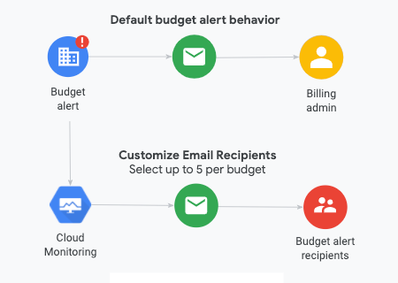

# Alertas de Orçamento (Budget Alert)

Para criar um novo orçamento (budget), você precisa:

- Criar e nomear um orçamento
- Definir o **escopo** do orçamento
- Definir a **quantidade** do orçamento
- Definir as regras e ações do **limite do orçamento** (budget threshold)
- Clicar para terminar e salvar um novo orçamento

Regras de limite (threshold rules) define os gatilhos de eventos para gerar uma notificação e-mail do budget.

Você consegue especificar os destinatários de e-mail dos alertas de orçamento do seguinte modo:

- **Role-based (default)**: você envia alertas de email para os Billing Account Administrators e Billing Account Users (que são recipientes)
- **Usar o Cloud Monitoring**, que você especifica outras pessoas (e-mails) na **organização** (como gerentes de projetos) para receber os budget alerts.

Para enviar e-mails relacionados a alertas de orçamento para usuários que não tenham o role de **billing administrator** ou de **billing user**, usa-se os canais de notificação do **Cloud Monitoring**.
