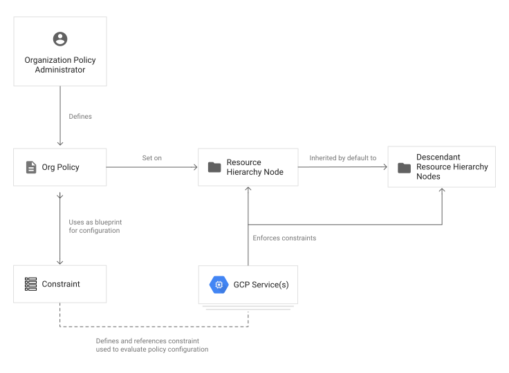

# Política da Organização

O **Organization Policy Service** (serviço de política da organização) oferece um controle centralizado sobre os recursos de nuvem na organização. É uma **configuração de limitações**

Enquanto o Identity Access Management (IAM) é focado no usuário, **quem** tem acesso , o Organization Policy foca no **o quê** deve ser acessado. Permite determinar como os recursos podem ser configurados

## Casos de usos comuns

- Definir e limitar equipes de devs para que permaneçam dentro dos limites de conformidade
- Limitar o uso de contas de serviço do IAM
- Restringir a localização física dos recursos recém-criados

## Restrições (Constraints)

É um tipo específico de limitação quanto a um serviço ou lista de serviços do Google Cloud. Toda a restrição tem um tipo:

- **Lista**. exemplo: uma lista de endereços IP que podem se conectar a uma máquina virtual
- **Booleano**. Exemplo: se contas de serviço externas podem ser criadas.
