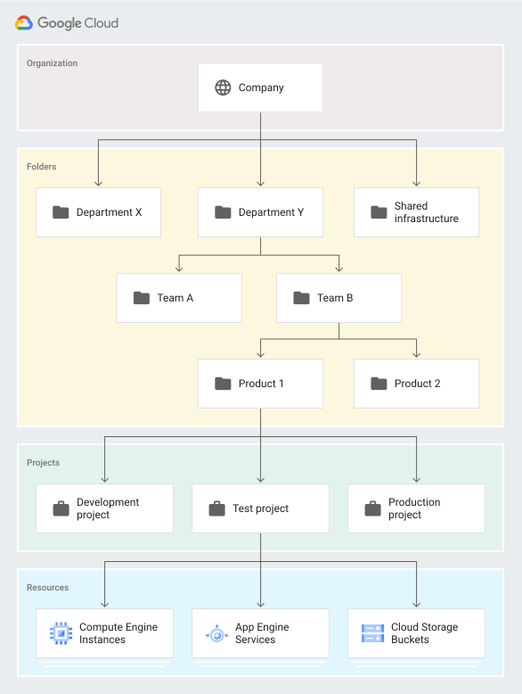

# Hierarquia de recursos da nuvem

O nó raiz da hierarquia de recursos do Google Cloud é a **Organização**, que é uma empresa

Depois há as **pastas** (folders) (**opcionais**) que são uma forma de agrupar e adicionar limites de isolamento entre projetos, podem ser usados para modelar  diferentes departamentos e equipes em uma organização. Pastas podem ser aninhadas.

Depois há os **projetos**, que é a entidade organizadora do nível base, sendo fundamental a necessidade de um projeto para a utilização de recursos

E por fim há os **recursos** do Google Cloud que são utilizados.

Com o **IAM do Google Cloud** é possível definir políticas e controlar quem (**usuários**) tem que tipo de acesso (**papéis/roles**) a quais **recursos**.

Quando você atribui um papel à um usuário, grupo ou conta de serviço em um específico elemento na hierarquia de recursos, a política se aplica ao elemento que você escolheu e para os elementos embaixo dele na hierarquia.

O método de usar a **herança** para atribuir papéis em um projeto é uma boa prática para ter um maior controle de acesso nos recursos, por exemplo, criar um grupo que tenha o role de `roles/storage.objectAdmin` no nível de organização para um usuário que deva gerenciar objetos no Cloud Storage em todos os projetos de uma organização.
