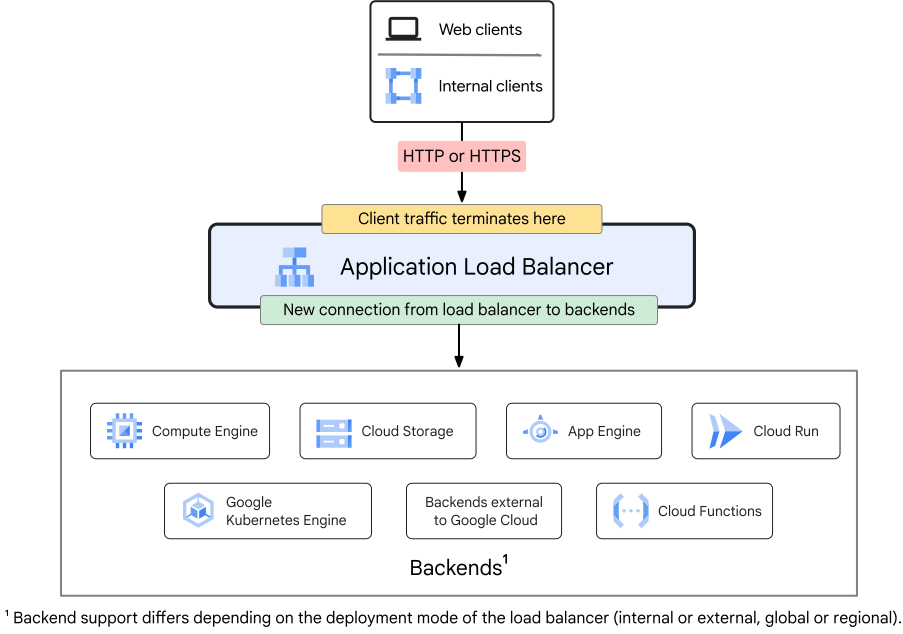
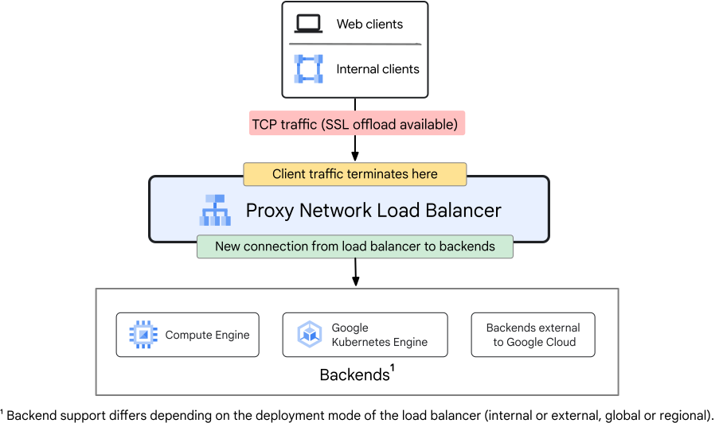
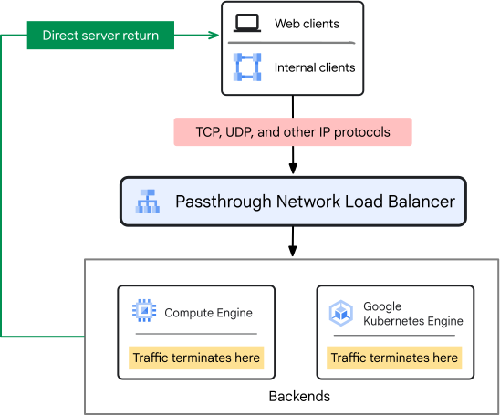
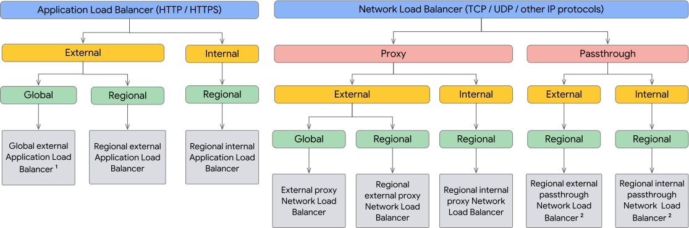

# Cloud Load balancing

Distribui o tráfego de usuários sem várias instâncias dos aplicativos criados. Com ele diminui o risco dos aplicativos de enfrentarem problemas de desempenho. Com ele é possível:

- Criar um **único endereço IP anycast**, sendo o front-end de todas as instâncias de back-end de várias regiões do mundo. Oferece um balanceamento de carga entre regiões com failover automático, redirecionando o tráfego para os back-ends de failover quando os principais não estão ativos.
- **LB definido por software:** não se preocupando com as soluções baseadas em dispositivos ou instâncias (infraestrutura física)
- **Escalonamento automático sem interrupções:** escalonado de acordo com o aumento do tráfego e do número de usuários, permitindo o fácil gerenciamento de grandes picos inesperados.
- **LB das camadas 4 e 7:** usado para direcionar o tráfego com base nos dados de protocolos de camada  4 de rede e transporte (TCP, UDP, ESP, GRE, ICMP e ICMPv6). E na camada 7 para HTTP headers e URIs
- **LB interno e externo:** disponibilidade de Internet e clientes do cloud.
- **LB e global e regional**

## Tipos de Load Balancing

### Balanceador de aplicativos

- São **proxy-based** da camada 7 que permite implementar e escalar serviços em um único endereço IP. Ele distribui um tráfego HTTP e HTTPS para backends hospedados em várias plataformas do Google Cloud (Compute Engine, GKE, Cloud Run) e backends fora do cloud
- Têm um deployment (implementação) interno ou externo (para a Internet)
- **External Application Load Balancers:** são implementados como serviços gerenciados nos **Google Front Ends** ou **Envoy proxies**
  - Podem ser regionais ou global
    - Sendo regionais: apenas com o Premium Tier
    - Sendo globais: apneas com o Standard Tier
- **Internal Application Load Balancers:** provê um LB com base em proxy dos dados do aplicativo na camada 7
  - Você especifica como o trafego é roteado com mapas de URL

### Balanceador de carga de rede

- São de camada 4 e lidam com tráfego TCP, UDP e outros protocolo IP. Podem ser de **carga de proxy** ou **carga de passagem**
- **Proxy Network LBs:** distribuem o tráfego TCP para as VMs da rede VPC do Google Cloud.
- Tem uma implementação (deployment) para a Internet ou interno:
  - **External proxy Network Load Balancers:** são de camada 4 que distribui o tráfego da Internet para back-ends na rede VPC doo Google Cloud ou outros ambientes de nuvem. podendo ser implantado global ou regional:
    - **Regional:** apenas com o Standard Tier (nível Standard)
    - **Global:** apenas com o Premium Tier
  - **Internal proxy Network Load Balancers:** são de camada 4 baseados em proxy do Envoy que permite executar e escalonar o tráfego do serviço TCP em um IP interno que só pode ser acessado por clientes na mesma rede VPC ou em clientes conectados à sua rede VPC.

- **Passthrough Network LBs:** são regionais de camada 4 e distribui o tráfego de back-end nam esma região do LB. Os pacotes são recebidos por VMs do back-end com endereço IP de origem e destino do pacote. As conexões são encerradas no back-ends. As respostas da VMs de back-end vão diretamente para os clientes (DSR - **direct server return**). Podem ser implantados para a Internet ou interno
  - **External passthrough Network Load Balancers:** criados no Maglev, os clientes se conectam a esse LB pela Internet.
  - **Internal passthrough Network Load Balancers** criados na pilha de virtualização da rede Andromeda. Permite balancear a carga do tráfego TCP/UDP por um endereço IP (só Premium Tier)

## Escolhendo um balanceador de carga

