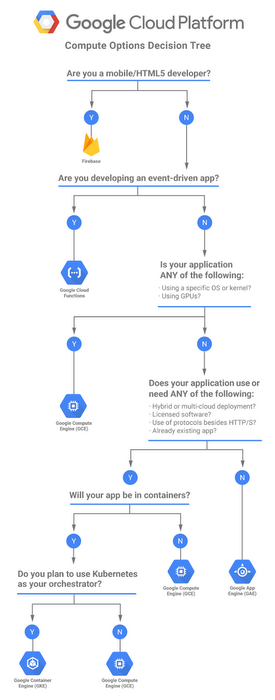

# Opções de computação

Existem 5 formas distintas de usar os recursos computacionais do Google Cloud, podendo ser serviços baseado em servidor, com você gerenciando e pagando apenas pela **infraestrutur**a, ou um serviço serverless que você paga apenas pelo **tempo de execução**.

- O Compute Engine e o Google Kubernetes Engine são baseados em servidor (server-based).
- O Compute Engine permite você implementar e gerenciar VMs que seus aplicativos serão hospedados.
- Com o GKE você implementa e gerencia clusters de nós de computação que você fará um deployment das imagens do container.

- Enquanto App Engine, Cloud Functions e o Cloud Run são opções sem servidor (**serverless**) que você **foca no código escrito** e o Google gerencia o hardware e o SO por baixo dos panos
- O **App Engine** oferece dois environments (ambientes) para executar ser executado: **standard** e o **flexible** (padrão ou flexível)
  - **Standard environment:** oferece a você um ambiente sandbox e abstrai totalmente a infraestrutura
  - **Flexible environment:** oferece a você maiores escolhas quando der o deploy do seu app. Sendo Executado em um contêiner do Docker, que permite outras linguagens de programação. E permite acessar recursos que estejam na rede do Compute Engine
- O **Cloud Run** permite rodar containers sem estado (stateless) via requisições web e eventos de serviços do Google Cloud. Ele opera usando Knative (uma plataforma open-source baseado em Kubernetes). Ele constrói (build), oferece um deploy, e gerencia workload serverless.
  

