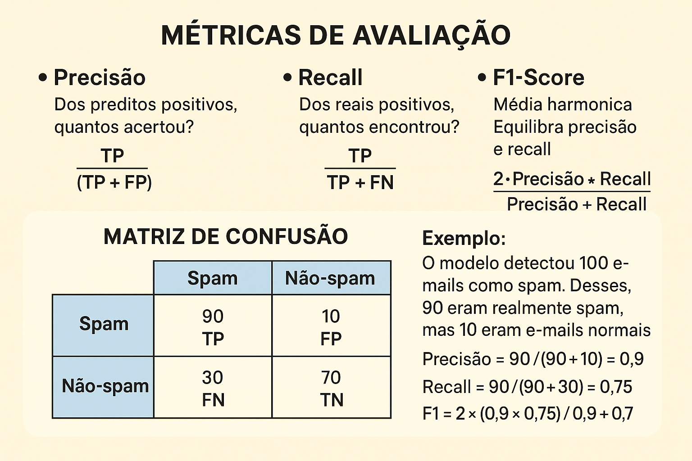

# Classificação

Algoritmos para predizer categorias

Problema do Desbalanceamento

- **95% Acurácia Enganosa**: Em classes muito desbalanceadas
- **5% Classe Minoritária**: Pode ser ignorada pelo modelo

> Cuidado: Alta acurácia nem sempre significa bom modelo!

## Algoritmos de Classificação

- **K-NN**: Baseado em instâncias
  - Classifica pela vizinhança
  - Lazy Learning
  - Usado para dados complexos que querem dizer a mesma coisa
  - Valores Categóricos
  - Similaridade
- **Naive Bayes**: Probabilístico
  - Usa teorema de Bayes
  - Assume Independência
  - Usado para Classificação textual, após Tokenização
  - Valores numéricos
  - Maturidade de interpretação muito grande
  - Detecção de Spam

## Métricas de Avaliação

### Definições

- **TP (True Positive / Verdadeiro Positivo)**: Casos que realmente eram positivos e o modelo acertou ao prever como positivo.
  - Exemplo: um e-mail que realmente era spam e o modelo previu como spam.
- **FP (False Positive / Falso Positivo)**: Casos que não eram positivos, mas o modelo errou ao prever como positivo.
  - Exemplo: um e-mail normal que o modelo classificou incorretamente como spam.
  - Também chamado de Erro Tipo I.
- **TN (True Negative / Verdadeiro Negativo)**:  Casos que realmente eram negativos e o modelo acertou ao prever como negativo.
  - Exemplo: um e-mail normal que o modelo corretamente classificou como "não spam".
- **FN (False Negative / Falso Negativo)**:  Casos que eram positivos, mas o modelo errou ao prever como negativo.
  - Exemplo: um e-mail que era spam, mas o modelo deixou passar como "não spam".
  - Também chamado de Erro Tipo II.

### Precisão

- TP / (TP + FP)
- Dos preditos positivos, quantos
acertou?

> **Exemplo - Sistema de detecção de spam**
>
> O modelo classificou 100 e-mails como spam.
>
> Desses, 90 eram realmente spam (TP) e 10 eram e-mails normais incorretamente classificados (FP).
>
> Precisão = 90 / (90 + 10) = 0,9 (90%).
> ➝ Isso significa que quando o modelo fala que é spam, há 90% de chance de estar certo.

### Recall

- TP / (TP + FN)
- Dos reais positivos, quantos
encontrou?

> **Exemplo - Ainda no cenário de detecção de spam**
>
> Temos 120 e-mails que realmente eram spam (TP + FN).
>
> O modelo detectou corretamente 90 deles (TP) e deixou escapar 30 (FN).
>
> Recall = 90 / (90 + 30) = 0,75 (75%).
> ➝ Isso significa que o modelo conseguiu identificar 75% de todos os spams existentes.

### F1-Score

- Média harmônica
- Equilibra precisão e recall

> Exemplo:
>
> - Precisão = 90%
> - Recall = 75%
>
> F1 = 2 × (0,9 × 0,75) / (0,9 + 0,75) ≈ 0,82 (82%)
> ➝ Isso mostra que o modelo tem um equilíbrio razoável: consegue identificar bem os spams sem errar tanto nos falsos positivos.

### **📊 Quando usar cada métrica?**

- Precisão: importante quando o custo de um falso positivo é alto.
  - Ex: Diagnóstico de câncer - não podemos sair dizendo que alguém tem a doença se não tiver.
- Recall: importante quando o custo de um falso negativo é alto.
  - Ex: Detecção de fraudes - melhor sinalizar uma transação suspeita (mesmo que algumas sejam normais) do que deixar uma fraude passar.
- F1-Score:  útil quando precisamos de um equilíbrio entre os dois.

