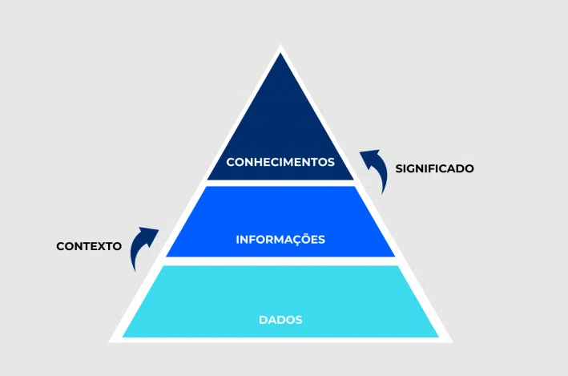
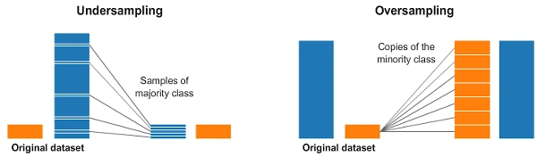

# Introdução - O Que é Mineração de Dados

É uma técnica auxiliada por um computador usada em análises para processar e interpretar grandes datasets

A mineração de dados extrai um significado ou conhecimento valioso dos datasets.

Através desses processos:

- **Coleta de dados**: captura de dados de diferentes fontes, ex: feedback do cliente, pagamentos e pedidos de compra
- **Data warehousing**: armazenagem dos dados em um grande database ou data warehouse
- **Análise de dados**:  processamento, armazenamento e análise dos dados usando software e algoritmos complexos

> A **Mineração de dados** é um ramo da análise de dados ou uma Estratégia de análise usada para encontrar padrões ocultos ou desconhecidos.

## O que é

- **Dados**: Elemento bruto, sem contexto
  - `25` é um dado inteiro
- **Informação**: é o dado organizado que possui um significado
  - `25º` Graus Celsius
- **Conhecimento**: É a informação assimilada e interpretada permitindo a compreensão e aplicação pra resolver problemas e gerar novas descobertas
  - `25º` Graus Celsius no período da tarde, irá fazer calor

## Metodologia

### KKD

- Processo Acadêmico
- 9 etapas lineares
- Foco no processo de descoberta de conhecimento
- Mais detalhado e sequencial e não tão flexível quando é necessário voltar para etapas anteriores

1. Seleção
2. Preparação
3. Transformação

### Crisp-DM

- Abordagem Comercial
- 6 Fases cíclicas
- Orientado a negócios
- Flexível e iterativo

### Na prática

Usa-se ambos conforme a necessidade

- KDD para pesquisa
- CRISP-DM para projetos

## Qualidade dos Dados

Problemas Comuns:

- Dados ausentes
- Duplicatas
- Outliers
- Inconsistências

Impactos:

- Modelos enviesados
- Baixa acurácia
- Decisões incorretas

- **80% do tempo** dos projetos de análise de dados é feito durante o pré-processamento, devido ao custo da qualidade de dados
- **60% do tempo** é melhoria sobre melhoria na acurácia com dados limpos

> Garbage in, garbage out - dados ruins geram modelos ruins.

## Análise Descritiva

### Medidas de tendência Central

- Média: Valor central aritmético, sensível a outliers
- Mediana: Valor do meio, robusta a outliers
- Moda: Valor mais frequente, útil para dados categóricos

### Medidas de dispersão

- **Variância**: Desvio médio quadrático
- **Desvio Padrão**: Raiz da variância
- **IQR**:Intervalo interquartil

### Medidas de forma

TODO: validar isso aqui

- Assimetria: 'skyness' - mede o grau de "inclinação"
  - Negativa: cauda esquerda
  - Positiva: cauda à direita
- Curtose: Mede o achatamento
  - Alta: Distribuição pontiaguda (leptocúrtica)
  - Baixa: Distribuição achatada (praticúrtica)
  - Mesocúrtica
  
### Correlação e Covariância

- Covariância: Mede variação conjunta, depende da escala
- Correlação: Covariância padronizada - Varia de -1 a 1, correlação de Pearson

## Amostragem

Técnicas para trabalhar com subconjuntos representativos

### Probabilísticas

- **Aleatória simples**
- **Estratificada**: Preserva proporções de **sub-grupos**
  - Exemplo: Grãos de café de diferentes tipos
- **Sistemática**: Olha como cada ponto se compara com o ponto seguinte.
  - Faz uma "mini clusterização" em pontos semelhantes

### Não-Probabilísticas

- Por conveniência
- Por julgamento
- Por cotas

## Classes Desbalanceadas

- Undersampling: Remove amostras da classe majoritária
- Oversampling: Aumenta amostras da classe minoritária
- SMOTE: Gera exemplos sintéticos inteligentes

## PCA: Redução de Dimensionalidade

- Maldição da Dimensionalidade: Muitas dimensões = dados esparsos
- Variância Explicada: % DA informação preservada
- Scree Plot: Gráfico para escolher componentes

### Interpretação de Componentes Principais - PCA Componentes

- Cargas: Peso de cada variável original
- Variância: Importância de cada componente
- Interpretação: Significado dos novos eixos
