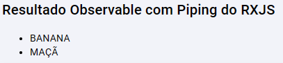

<h1> Conteúdo 03 </h1>

# RXJS Pipe

Um Pipe do RXJS é diferente do Pipe do Angular

O RxJs disponibiliza operadores para trabalhar com os Observables dde forma declarativa e clara. Sendo operadores, funções. Há dois tipos de operadores:

- **Pipeable Operators**: Podem ser *piped* (canalizados) ou seja, utilizar a sintaxe `observableInstance.pipe(operator)`, ou `observableInstance.pipe(operatorFactory())`, para manipular um fluxo de informações.
- **Creation Operators**: usadas pra criar novos Obeservables, exemplo `of(1,2,3)`

```ts
import { of, map } from 'rxjs';
of(1, 2, 3)
  .pipe(map((x) => x * x))
  .subscribe((v) => console.log(`value: ${v}`));
```

## Piping

Observables têm o método `.pipe()` para facilitar a clareza na leitura durante a transformação dos dados do Observable. Ele transforma os dados emitidos por um Observable antes de dar ao Observador (`subscribe`)

É possível usar o método `tap` para **side-effects** para notificar e monitorar as mudanças do Observable fonte

Exemplo de uso no Angular:

```ts
constructor() {
  of('banana', 'pitaia', 'pera', 'maçã')
    .pipe(
      map((fruta) => fruta.toUpperCase()),
      filter((fruta) => fruta.startsWith('B') || fruta.startsWith('M')),
      tap(console.log)
    )
    .subscribe((result) => {
      this.frutas.push(result);
    });
}
```

Resultado:



Uma [boa prática](https://angular.io/guide/rx-library#naming-conventions-for-observables) para os Observables, é sufixar a variável com o símbolo de dólar **($)** para indicar os Observables:

```ts
import { filter, map, of, tap } from 'rxjs';

frutas$ = of('banana', 'pitaia', 'pera', 'maçã');

constructor() {
  this.frutas$
    .pipe(
      map((fruta) => fruta.toUpperCase()),
      filter((fruta) => fruta.startsWith('B') || fruta.startsWith('M')),
      tap(console.log)
    )
    .subscribe((result) => {
      this.frutas.push(result);
    });
}
```

É possível combinar Observables, por exemplo chamar duas APIs concorrentemente, e retornar ao usuário apenas um retorno.

# Resgatando dados pelo URL

- Adicione uma nova rota no module de rotas de produto `product-routing.module.ts`

```ts
const routes: Routes = [
  { path: '', redirectTo: 'list', pathMatch: 'full' },
  { path: 'list', component: ListingComponent },
  { path: 'new', component: RegisterComponent },
  { path: 'edit/:id', component: RegisterComponent },
];
```

- Crie um novo método no **service** de produto para resgatar um único produto pelo ID

```ts
export class ProductService {
  private baseApiUrl = 'http://localhost:3000/';

  constructor(private http: HttpClient) {}

  getProducts(): Observable<ProductList> {
    return this.http.get<ProductList>(`${this.baseApiUrl}products`);
  }

  // novo método para resgatar o produto pelo IDd
  getProductById(id: string): Observable<Product> {
    return this.http.get<Product>(`${this.baseApiUrl}products/${id}`);
  }
}
```

- Resgate o produto no componente que será renderizado o produto, utilizando o serviço injetado de router `ActivatedRoute`

```ts
export class RegisterComponent implements OnInit {
  id!: string;
  product!: Product;

  constructor(
    private ProductService: ProductService,
    private activatedRoute: ActivatedRoute
  ) {}

  ngOnInit(): void {
    // pegar o id do produto em uma url: [//http](http://localhost:4200/product/edit/1)
    // sendo o '/product', o url raiz
    this.id = this.activatedRoute.snapshot.url[1].path;

    this.ProductService.getProductById(this.id).subscribe(
      (product: Product) => (this.product = product)
    );
  }
}
```

# Capturar e Preencher os campos de um Formulário

## Utilizando Template Driven (forma antiga)

## Utilizando Reactive Forms
